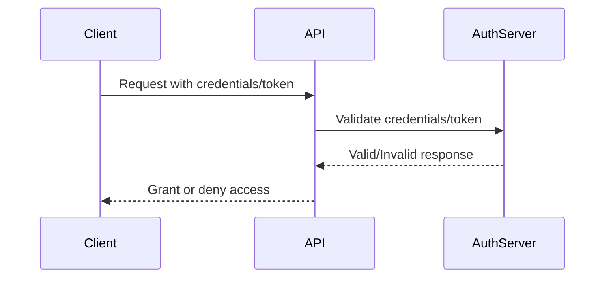
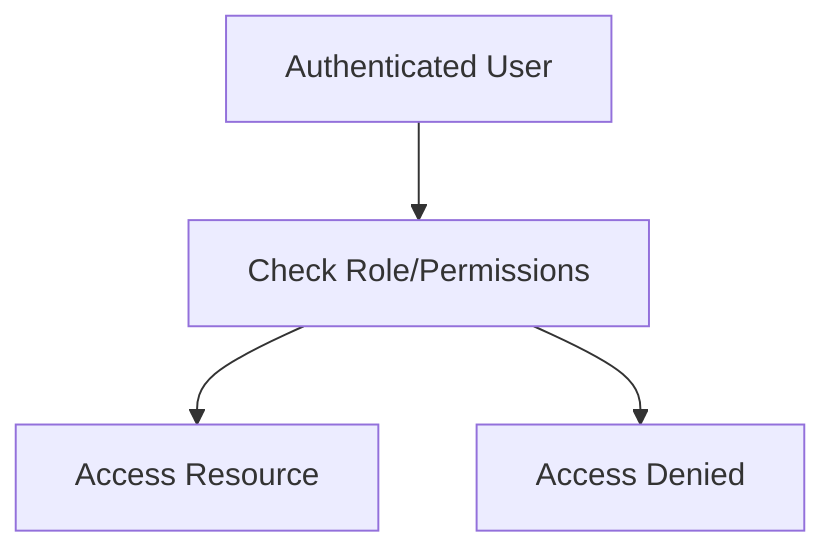
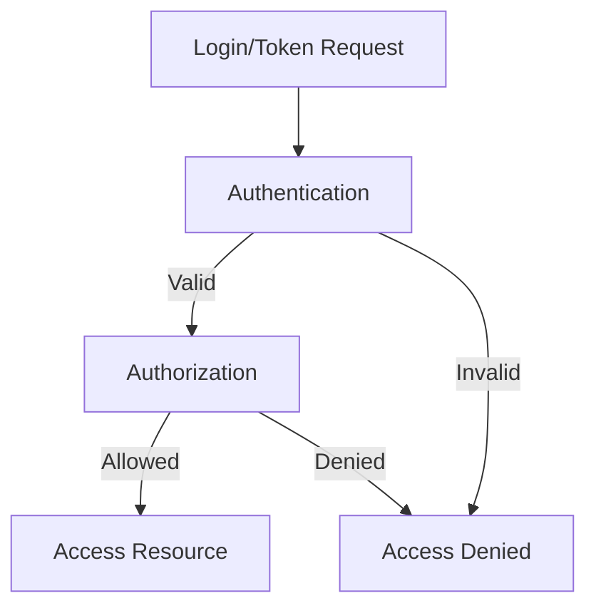

## Api Authentication and Authorization:-

---

### 👋 Interactive Introduction

**Authentication**
> _"Who are you?"_
- Authentication is how an API verifies your identity. Imagine logging into a website—your username and password prove who you are.
- **Try it:** What credentials do you use to access your favorite app?

**Authorization**
> _"What can you do?"_
- Authorization decides what you can do after logging in. Like having a concert ticket: you can enter, but only VIPs get backstage.
- **Try it:** After logging in, which features are open to you? Are any restricted?

---

### 🔑 Types of Authentication Mechanisms
1. **API Keys** – Simple tokens in requests. Easy, but not highly secure.
    - _Example:_ `GET /data?api_key=12345`
2. **OAuth (Open Authorization)** – Lets users grant limited access to their resources without sharing credentials. Used by Google, Facebook, etc.
    - _Example:_ "Sign in with Google" button.
3. **JWT (JSON Web Tokens)** – Encoded tokens with user info, signed for integrity. Used for stateless authentication.
    - _Example:_ `Authorization: Bearer <jwt_token>`
4. **Bearer Tokens** – Generic tokens sent in the `Authorization` header. Often used with OAuth and JWT.
    - _Example:_ `Authorization: Bearer <token>`

---

### 🛡️ Types of Authorization Mechanisms
1. **Role-Based Access Control (RBAC)** – Users get roles (admin, user, guest) with specific permissions.
    - _Example:_ Only admins can delete users.
2. **OAuth 2.0 and OpenID Connect (OIDC)** – Scopes and claims define what resources/actions are allowed. Used for delegated access and identity.
    - _Example:_ App requests permission to access your email.
3. **Permission-Based Access Control (PBAC)** – Fine-grained permissions for actions/resources. More flexible than RBAC.
    - _Example:_ User can read but not write to a document.

---

### 💡 Best Practices for API Authentication and Authorization
- Use HTTPS for all API traffic
- Store secrets securely (env vars, vaults)
- Use short-lived tokens and refresh tokens
- Apply least privilege principle
- Monitor and log all access events
- Regularly review and update permissions


---

# 🛡️ API Authentication and Authorization: In-Depth Theory, Examples & Diagrams

## What is Authentication?
Authentication is the process of verifying the identity of a user or system. In APIs, it answers the question: **Who are you?**

**Example Analogy:**
> When you log into a website, you provide a username and password. The system checks if you are who you claim to be.

**Common Authentication Mechanisms:**
- **API Keys:** Simple tokens passed in requests. Easy to implement, but less secure for sensitive data.
- **JWT (JSON Web Tokens):** Encoded tokens containing user info, signed for integrity. Used for stateless authentication.
- **OAuth2:** Industry-standard protocol for delegated access. Used by Google, Facebook, etc.
- **Bearer Tokens:** Generic tokens sent in the `Authorization` header.
- **Basic Auth:** Username and password encoded in base64 (not recommended for production).

**Authentication Flow Diagram:**


**FastAPI Example (JWT Authentication):**
```python
from fastapi import Depends, HTTPException
from fastapi.security import OAuth2PasswordBearer
oauth2_scheme = OAuth2PasswordBearer(tokenUrl="token")

def get_current_user(token: str = Depends(oauth2_scheme)):
    # Validate JWT token here
    if not validate_token(token):
        raise HTTPException(status_code=401, detail="Invalid token")
    return get_user_from_token(token)
```

---

## What is Authorization?
Authorization determines **what actions a user can perform** after they are authenticated. It answers: **What can you do?**

**Example Analogy:**
> After logging in, you may have access to your own data, but not admin features. Authorization enforces these rules.

**Common Authorization Mechanisms:**
- **Role-Based Access Control (RBAC):** Users are assigned roles (admin, user, guest) with specific permissions.
- **Permission-Based Access Control (PBAC):** Fine-grained permissions for actions/resources.
- **OAuth2/OIDC:** Scopes and claims define what resources/actions are allowed.

**Authorization Flow Diagram:**


**FastAPI Example (Role-Based Authorization):**
```python
from fastapi import Depends, HTTPException

def require_admin(user = Depends(get_current_user)):
    if user.role != "admin":
        raise HTTPException(status_code=403, detail="Not enough permissions")
```

---

## Best Practices for API Authentication & Authorization
- Always use HTTPS to encrypt data in transit
- Store secrets securely (environment variables, vaults)
- Use short-lived tokens and refresh tokens
- Implement rate limiting and monitoring
- Apply the principle of least privilege
- Log authentication and authorization events

---

## Summary Table: Mechanisms & Use Cases
| Mechanism         | Type           | Use Case                        |
|-------------------|----------------|---------------------------------|
| API Key           | Authentication | Simple, low-security APIs       |
| JWT               | AuthN/AuthZ    | Stateless, scalable APIs        |
| OAuth2            | AuthN/AuthZ    | Third-party delegated access    |
| RBAC              | Authorization  | Role-based permissions          |
| PBAC              | Authorization  | Fine-grained access control     |
| Basic Auth        | Authentication | Legacy, not recommended         |

---

## Visual Summary: Combined AuthN & AuthZ Flow

