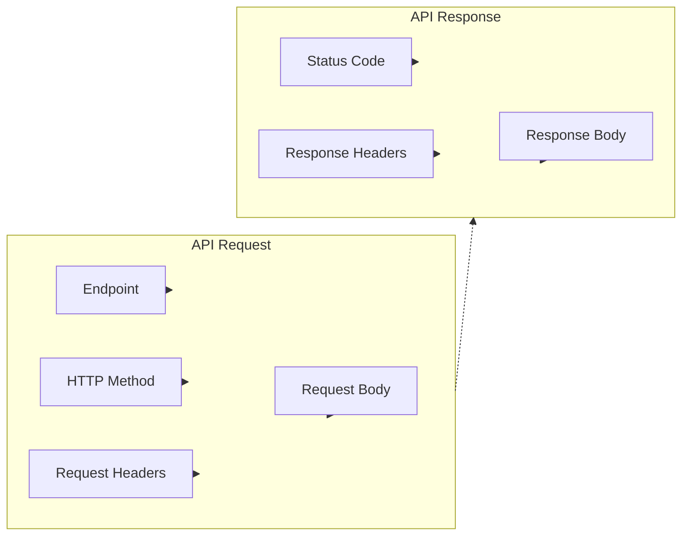
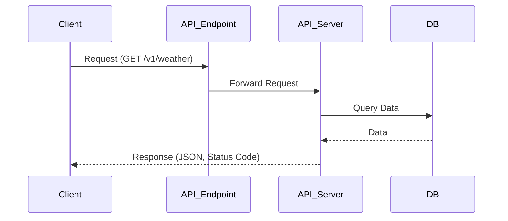
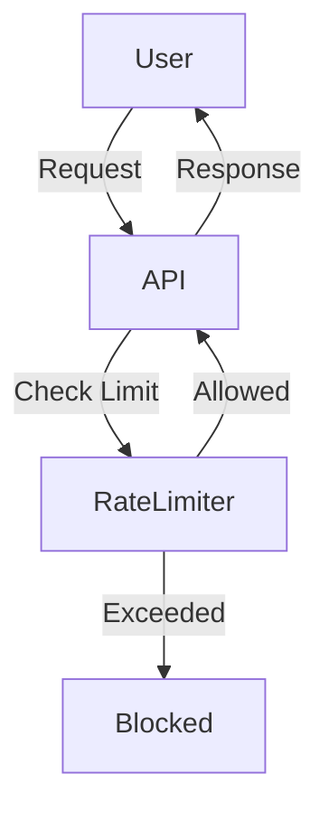

# 🧩 API Components: In-Depth Explanation

---

APIs are made up of several key components that define how clients and servers communicate. Understanding these components is essential for designing, consuming, and debugging APIs.

---

## 1. Endpoint

**Theory:**
- An endpoint is a specific URL where an API can be accessed. It represents a resource or service (e.g., `/v1/users`, `/v1/weather`).
- Endpoints are organized by resource type and versioning.

**Example:**
- `https://api.example.com/v1/weather?city=Delhi`

---

## 2. Request

**Theory:**
- The request is sent by the client to the API endpoint. It includes:
	- **HTTP Method:** GET, POST, PUT, DELETE, PATCH, etc.
	- **Request Headers:** Metadata (e.g., authentication tokens, content type).
	- **Request Body:** Data payload (for POST/PUT requests).

**Example:**
```http
POST https://api.example.com/v1/users
Content-Type: application/json
Authorization: Bearer <token>
{
	"name": "Alice"
}
```

---

## 3. Response

**Theory:**
- The response is sent by the API server back to the client. It includes:
	- **Status Code:** 200 (OK), 404 (Not Found), etc.
	- **Response Headers:** Metadata about the response (e.g., content type, CORS).
	- **Response Body:** The requested data or error message, usually in JSON or XML.

**Example:**
```json
{
	"id": 123,
	"name": "Alice",
	"created": "2025-08-26T10:00:00Z"
}
```

---

## 4. Rate Limiting and Quotas

**Theory:**
- APIs often enforce rate limits and quotas to prevent abuse and ensure fair usage.
- Rate limiting restricts the number of requests a client can make in a given time period.
- Quotas define the maximum allowed usage for a client or application.

**Example:**
- "1000 requests per hour per user"

---

## 🖼️ API Request & Response Structure (Mermaid Diagram)


---

## 🖼️ End-to-End API Communication (Mermaid Diagram)


---

## 🖼️ Rate Limiting & Quotas (Mermaid Diagram)


---

## In-Depth Theory

- **Endpoint:** The unique address for accessing a specific resource or service. Endpoints are versioned and organized for scalability and maintainability.
- **HTTP Method:** Defines the action to perform (GET for retrieval, POST for creation, PUT for update, DELETE for removal, PATCH for partial update).
- **Request Headers:** Carry metadata such as authentication tokens, content type, and custom information for the server to process the request correctly.
- **Request Body:** Contains the actual data sent to the server, especially for POST/PUT requests (e.g., user details, form data).
- **Status Code:** Indicates the result of the request (success, error, etc.). Common codes: 200 (OK), 201 (Created), 400 (Bad Request), 401 (Unauthorized), 404 (Not Found), 500 (Server Error).
- **Response Headers:** Provide metadata about the response, such as content type, caching policies, and CORS settings.
- **Response Body:** Contains the data returned by the server, usually in JSON or XML format.
- **Rate Limiting & Quotas:** Protects the API from abuse, ensures fair usage, and maintains performance. Implemented via tokens, counters, or time windows.

---

## Example API Interaction

1. **Client** sends a request to the **Endpoint** using a specific **HTTP Method** with **Headers** and optional **Body**.
2. **API Server** processes the request, checks rate limits, validates data, and interacts with the database or other services.
3. **API Server** sends a **Response** with a **Status Code**, **Headers**, and **Body** back to the client.
4. If rate limits are exceeded, the client receives an error response (e.g., 429 Too Many Requests).

---
				B1[Status Code]
				B2[Response Headers]
				B3[Response Body]
		end
		A1 --> API_Request
		A2 --> API_Request
		A3 --> API_Request
		A4 --> API_Request
		B1 --> API_Response
		B2 --> API_Response
		B3 --> API_Response
		API_Request -.-> API_Response
```

---

## Reference: Working of API

- The API workflow involves: Request Initiation → API Endpoint → Request Processing → Response Generation.
- Each component above plays a role in this workflow, ensuring reliable and secure communication.
