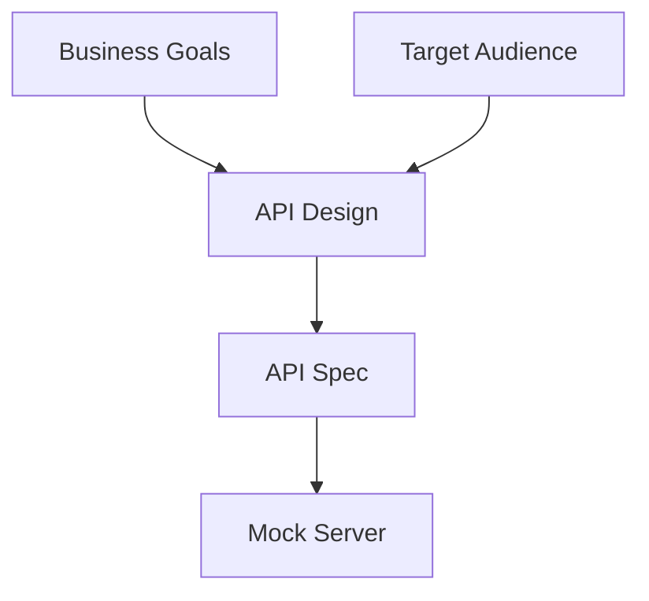
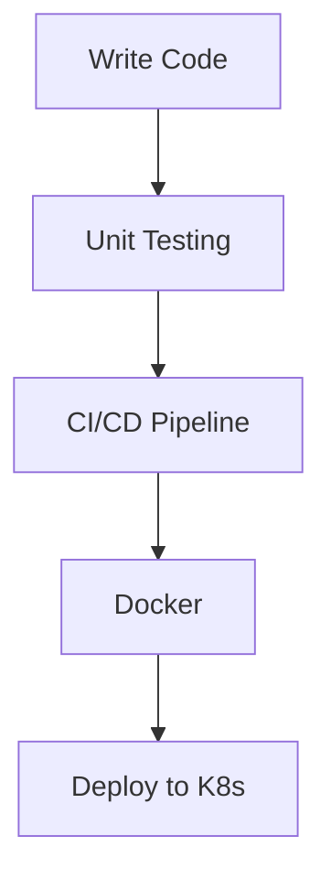
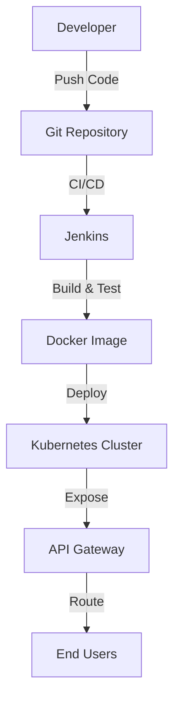
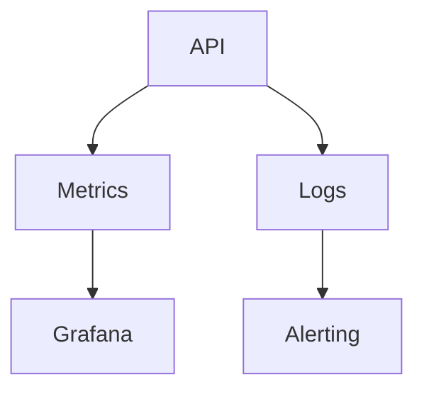
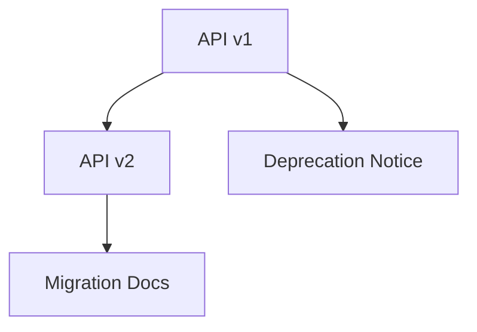
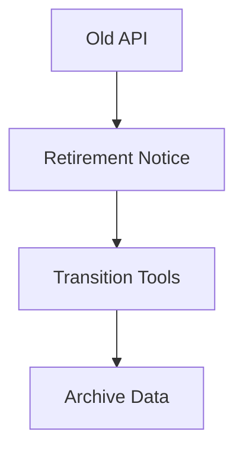
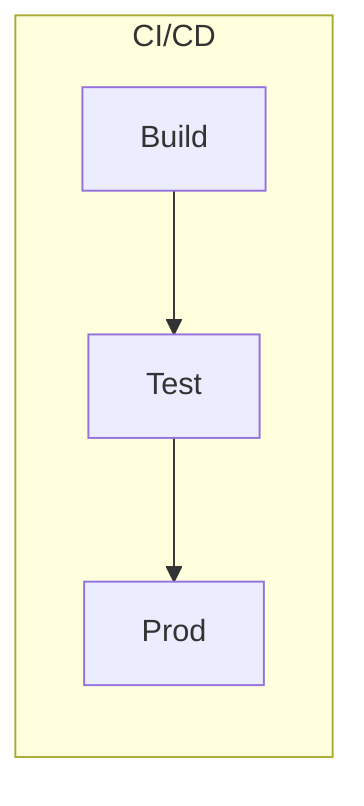
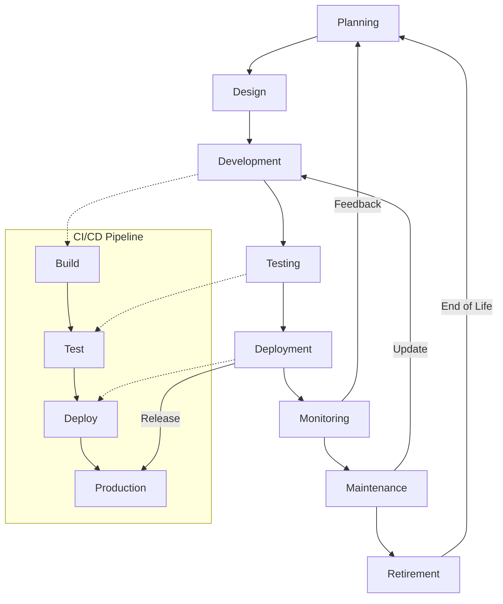

# 🚀 API Lifecycle: In-Depth Theory, Examples & Diagrams

---

The API lifecycle covers every stage from initial planning to retirement. Each phase is crucial for building robust, secure, and scalable APIs. Below is a detailed breakdown, referencing your steps and expanding with technical theory, examples, and diagrams.

---

## 1. Planning and Design

**Theory:**
- Identify business goals, user needs, and problems the API will solve.
- Determine the target audience (developers, partners, internal teams).
- Define endpoints, request/response formats, and data models.
- Follow design methodologies (REST, GraphQL, gRPC).
- Ensure best practices: intuitive endpoints, consistent naming, versioning.

**Example:**
- Designing a weather API with `/v1/weather?city=Delhi` and JSON responses.

**Diagram:**

---

## 2. Development

**Theory:**
- Implement backend logic and infrastructure using frameworks (Flask, FastAPI, Express.js).
- Integrate authentication & security (OAuth2, JWT, API keys).
- Perform unit and integration testing.

**Tools:**
- Git, Jenkins, Docker, Kubernetes.

**Example:**
- Writing a FastAPI endpoint for weather data, securing with JWT.

**Diagram:**

---

## 3. Deployment

**Theory:**
- Release API to production.
- Deploy to staging, testing, and production environments.
- Use cloud platforms (AWS, Azure, GCP) for scalability.
- Set up API Gateway for routing, caching, load balancing.

**Popular Gateways:** AWS API Gateway, Kong, Apigee.

**Diagram:**

---

## 4. Monitoring and Management

**Theory:**
- Track metrics: response times, uptime, error rates.
- Gather usage data: traffic patterns, popular endpoints, user behavior.
- Identify areas for optimization.
- Enforce rate limiting to prevent abuse.

**Tools:** Datadog, New Relic, Grafana.

**Diagram:**

---

## 5. Updates and Versioning

**Theory:**
- Ensure updates do not break existing clients.
- Provide migration paths for breaking changes.
- Notify users of deprecated features/versions.
- Set timelines and guidelines for transition.

**Diagram:**

---

## 6. Retirement

**Theory:**
- Retire or deprecate APIs that no longer serve their purpose.
- Inform stakeholders and users well in advance.
- Provide tools/resources for transition.
- Archive or securely dispose of stored data.

**Diagram:**

---

## Key Takeaways
- The API lifecycle is a continuous process: plan, build, deploy, monitor, update, retire.
- Each stage has specific best practices, tools, and technical considerations.
- Diagrams help visualize the flow, architecture, and interactions throughout the lifecycle.

---

## 🖼️ CI/CD Pipeline Stages (Mermaid Diagram)

---

## 🖼️ Comprehensive API Lifecycle & CI/CD Pipeline (Detailed Mermaid Diagram)

This diagram shows the full API lifecycle, with each stage connected to the CI/CD pipeline. Feedback loops and update cycles are included for a realistic, professional workflow.