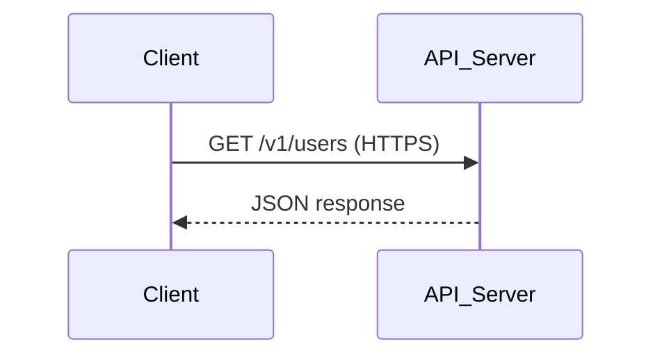

# 🔗 API Protocols: In-Depth Guide

---

## What Are API Protocols?

API protocols define the rules and conventions for how data is exchanged between applications and services. They ensure interoperability, security, and reliability in communication.

---

## 1. **HTTP/HTTPS (HyperText Transfer Protocol / Secure)**

**Theory:**
- The most common protocol for web APIs.
- Uses request methods like GET, POST, PUT, DELETE.
- HTTPS adds encryption for secure data transfer.

**Example:**
```http
GET https://api.example.com/v1/users
```

**Mermaid Diagram:**


---

## 2. **REST (Representational State Transfer)**

**Theory:**
- Architectural style using HTTP for stateless communication.
- Resources are identified by URLs; operations use HTTP methods.
- Responses are typically in JSON or XML.

**Example:**
```http
POST https://api.example.com/v1/users
Content-Type: application/json
{
	"name": "Alice"
}
```

---

## 3. **SOAP (Simple Object Access Protocol)**

**Theory:**
- XML-based protocol for exchanging structured information.
- Uses HTTP, SMTP, or other transport protocols.
- Strict standards, supports complex operations and security features.

**Example:**
```xml
<soap:Envelope xmlns:soap="http://www.w3.org/2003/05/soap-envelope">
	<soap:Body>
		<GetUser>
			<UserId>123</UserId>
		</GetUser>
	</soap:Body>
</soap:Envelope>
```

---

## 4. **GraphQL**

**Theory:**
- Query language for APIs developed by Facebook.
- Allows clients to request exactly the data they need.
- Single endpoint for all queries and mutations.

**Example:**
```graphql
query {
	user(id: "123") {
		name
		email
	}
}
```

---

## 5. **gRPC (Google Remote Procedure Call)**

**Theory:**
- High-performance protocol using HTTP/2 and Protocol Buffers.
- Supports bi-directional streaming and strong typing.
- Used for microservices and real-time communication.

**Example:**
```proto
service UserService {
	rpc GetUser (UserRequest) returns (UserResponse);
}
```

---

## 6. **WebSockets**

**Theory:**
- Protocol for full-duplex communication over a single TCP connection.
- Enables real-time data exchange (e.g., chat apps, live dashboards).

**Example:**
```javascript
const ws = new WebSocket('wss://example.com/socket');
ws.onmessage = (event) => console.log(event.data);
```

---

## 📊 Comparison Table

| Protocol   | Data Format | Use Case                | Security | Example                |
|------------|------------|-------------------------|----------|------------------------|
| HTTP/HTTPS | JSON/XML   | Web APIs                | High     | REST, SOAP             |
| REST       | JSON/XML   | CRUD operations         | High     | Twitter API            |
| SOAP       | XML        | Enterprise integrations | High     | Payment gateways       |
| GraphQL    | JSON       | Flexible queries        | High     | GitHub API             |
| gRPC       | Protobuf   | Microservices           | High     | Google APIs            |
| WebSockets | Any        | Real-time apps          | Medium   | Chat, live dashboards  |

---

## 📝 Key Takeaways

- API protocols define how data is exchanged and processed.
- REST and HTTP/HTTPS are most common for web APIs.
- SOAP is used for enterprise and legacy systems.
- GraphQL and gRPC offer modern, flexible, and high-performance solutions.
- WebSockets enable real-time communication.

---

> **Choosing the right API protocol is essential for building secure, scalable, and efficient applications!**
