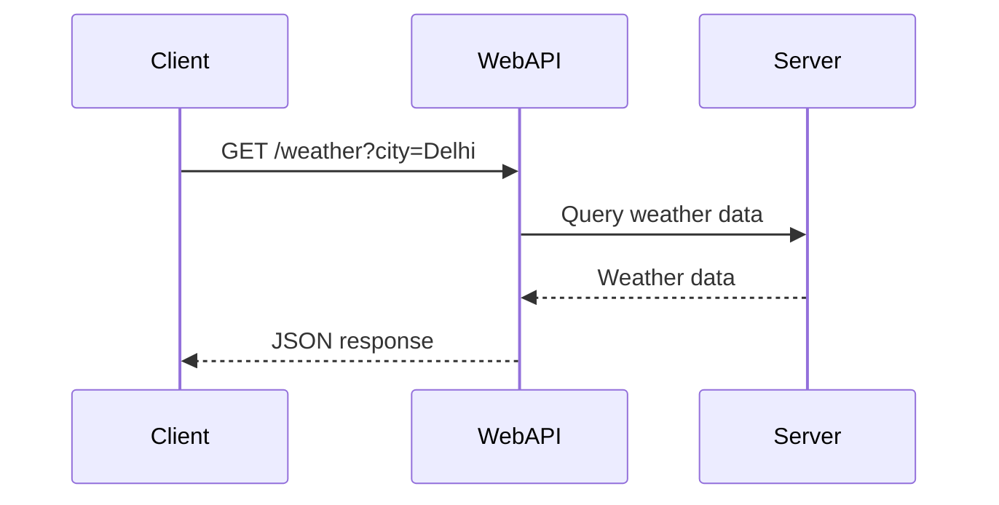
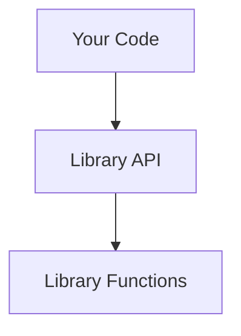
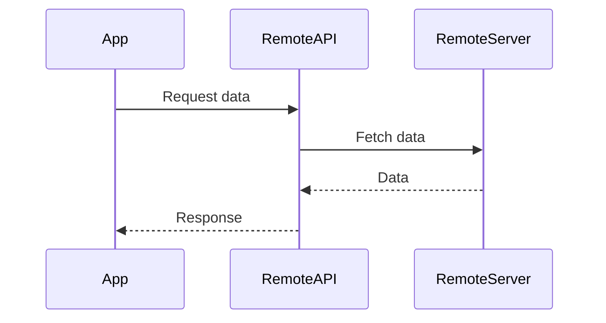
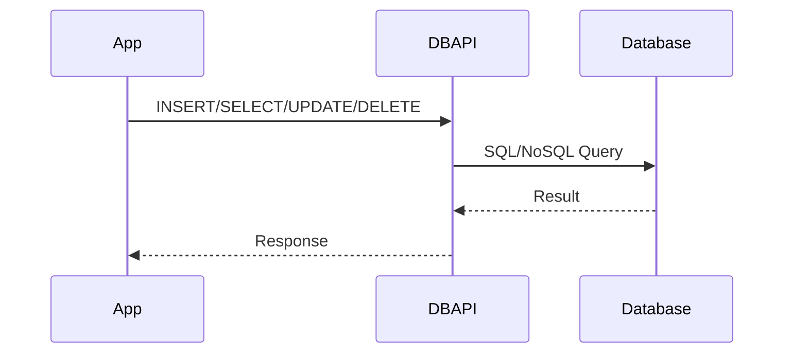
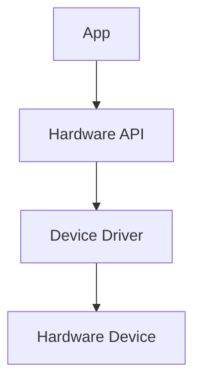
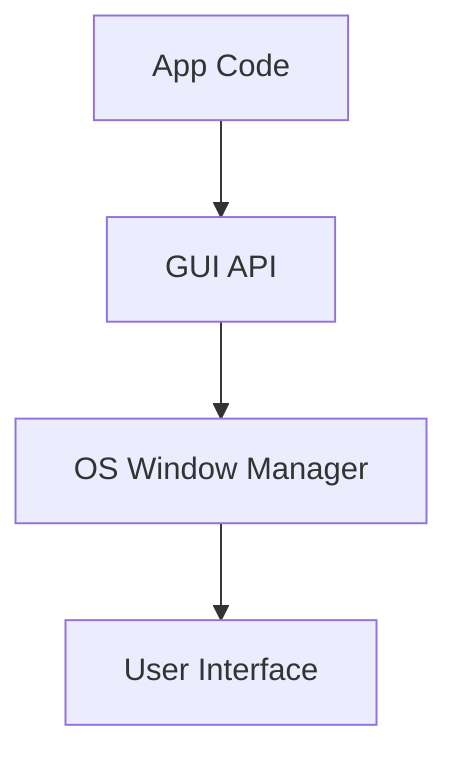
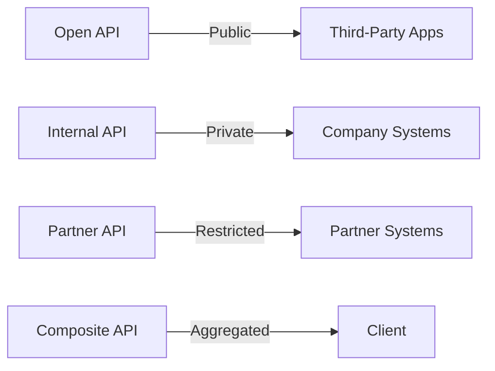

# 🏗️ Types of APIs: In-Depth Guide with Examples

---

## What Are API Types?

APIs (Application Programming Interfaces) are categorized by their intended audience, access level, and technical design. Choosing the right API type is crucial for security, scalability, and integration.

---

## 1. **Web API**

**Definition:**
Web APIs are interfaces that allow applications to communicate over the web (HTTP/HTTPS). They are typically RESTful or use GraphQL, and are accessible via URLs.

**Theory:**
- Web APIs expose endpoints for clients to send requests and receive responses, often in JSON or XML format.
- They are stateless and scalable, making them ideal for cloud and distributed systems.

**Examples:**
- Twitter API: Fetch tweets, post updates.
- Google Maps API: Get geolocation and map data.

**Mermaid Diagram:**


---

## 2. **Library API**

**Definition:**
Library APIs are sets of functions, classes, or methods provided by a software library for use in code. They are accessed locally within the same application or environment.

**Theory:**
- Library APIs abstract complex operations, making it easier for developers to use advanced features without knowing the internal implementation.
- They are language-specific and often come with documentation and examples.

**Examples:**
- NumPy (Python): Mathematical operations on arrays.
- jQuery (JavaScript): DOM manipulation and AJAX calls.

**Mermaid Diagram:**


---

## 3. **Remote API**

**Definition:**
Remote APIs are designed to interact with systems located on a different network or server, often through the internet or intranet.

**Theory:**
- Web API is a subset of Remote API (all Web APIs are Remote APIs, but not all Remote APIs are Web APIs).
- Remote APIs can also include Intranet APIs, accessible only within a private network.

**Examples:**
- Deploying virtual machines using AWS EC2 API.
- Retrieving remote files stored in Google Drive through its API.

**Mermaid Diagram:**


---

## 4. **Database API**

**Definition:**
Database APIs allow applications to interact with databases, providing a structured way to perform CRUD (Create, Read, Update, Delete) operations.

**Theory:**
- Database APIs abstract the underlying database queries, making it easier to manage data securely and efficiently.
- They support both SQL and NoSQL databases.

**Examples:**
- MySQL Connector API: Enables interaction with MySQL databases.
- MongoDB API: Allows CRUD operations on NoSQL data.
- Firebase Realtime Database API: Facilitates real-time database interactions.

**Mermaid Diagram:**


---

## 5. **Hardware API**

**Definition:**
Hardware APIs allow software to interact with hardware devices, such as sensors, printers, cameras, or GPUs.

**Theory:**
- Hardware APIs provide functions to send commands, read data, or control hardware features.
- They often require drivers or low-level system access.

**Examples:**
- OpenGL API: Interact with graphics hardware for rendering.
- Windows Printer API: Send print jobs to printers.
- Android Camera API: Capture images and video.

**Mermaid Diagram:**


---

## 6. **GUI API**

**Definition:**
GUI (Graphical User Interface) APIs allow developers to create and manage graphical interfaces, such as windows, buttons, and menus.

**Theory:**
- GUI APIs abstract the complexity of drawing and event handling, making it easier to build interactive applications.
- They are platform-specific (e.g., Windows, macOS, Android) or cross-platform (e.g., Qt, Tkinter).

**Examples:**
- Tkinter (Python): Build desktop GUI applications.
- Java Swing: Create windows and controls in Java.
- Electron (JavaScript): Build cross-platform desktop apps.

**Mermaid Diagram:**


---

## 📊 Comparison Table

| Type         | Purpose                          | Example                        | Access Scope      |
|--------------|----------------------------------|--------------------------------|-------------------|
| Web API      | Web-based communication          | Twitter API, Google Maps       | Internet/Public   |
| Library API  | Local code functionality         | NumPy, jQuery                  | Local/Codebase    |
| Remote API   | Remote system interaction        | AWS EC2, Google Drive          | Internet/Intranet |
| Database API | Database operations              | MySQL Connector, MongoDB       | Local/Remote      |
| Hardware API | Hardware device control          | OpenGL, Printer API            | Local/Remote      |
| GUI API      | Graphical interface management   | Tkinter, Java Swing, Electron  | Local/OS          |

---

## 📝 Best Practices for API Design

- Choose the API type based on your audience and security needs.
- Use strong authentication and authorization for sensitive APIs.
- Document endpoints, request/response formats, and error codes.
- Monitor usage and set rate limits.
- Version your APIs for backward compatibility.

---

## Real-World API Examples

### Web API Example: Twitter

```http
GET https://api.twitter.com/2/tweets?ids=1453489038376132611&tweet.fields=created_at&apikey=YOUR_API_KEY
```

### Library API Example: NumPy

```python
import numpy as np
arr = np.array([1, 2, 3])
print(np.mean(arr))
```

### Remote API Example: AWS EC2

```bash
aws ec2 describe-instances --region us-east-1
```

### Database API Example: MongoDB

```python
from pymongo import MongoClient
client = MongoClient('mongodb://localhost:27017/')
db = client['testdb']
db.users.insert_one({'name': 'Alice'})
```

### Hardware API Example: OpenGL

```c
glBegin(GL_TRIANGLES);
glVertex2f(0.0, 1.0);
glVertex2f(-1.0, -1.0);
glVertex2f(1.0, -1.0);
glEnd();
```

### GUI API Example: Tkinter

```python
import tkinter as tk
root = tk.Tk()
tk.Label(root, text="Hello, GUI!").pack()
root.mainloop()
```

---

## 📝 Key Takeaways

- Each API type serves a unique purpose and use case.
- Web APIs enable internet-based communication, while Library APIs provide local code functionality.
- Remote APIs interact with distant systems, Database APIs manage data, Hardware APIs control devices, and GUI APIs build user interfaces.
- Understanding API types helps you design better, more secure, and scalable systems.

---

> **Mastering API types is essential for building robust, secure, and scalable digital solutions!**
# 🏗️ Types of APIs: In-Depth Guide with Examples

---

## What Are API Types?

APIs (Application Programming Interfaces) are categorized by their intended audience, access level, and technical design. Choosing the right API type is crucial for security, scalability, and integration.

---

## 1. **Open APIs (Public APIs)**

**Definition:**
Open APIs are accessible to anyone, often with minimal restrictions. They encourage third-party development and innovation.

**Technical Features:**

- RESTful or GraphQL, with clear documentation
- Authentication via API keys or OAuth
- Rate limiting and monitoring to prevent abuse

**Use Cases:**

- Social media integrations (e.g., Twitter API, Facebook Graph API)
- Weather data services (e.g., OpenWeatherMap)
- Mapping and geolocation (e.g., Google Maps API)

**Example:**

```http
GET https://api.openweathermap.org/data/2.5/weather?q=Delhi&appid=YOUR_API_KEY
```

**Pros:**

- Easy access and wide adoption
- Encourages innovation and third-party development
- Extensive community support

**Cons:**

- Security risks if not properly managed
- Rate limiting to prevent abuse
- Data privacy concerns

---

## 2. **Internal APIs (Private APIs)**

**Definition:**
Internal APIs are used exclusively within an organization. They connect internal systems, microservices, and databases.

**Technical Features:**

- Secure protocols (HTTPS, VPN)
- Custom authentication (JWT, SSO)
- Not documented for public use

**Use Cases:**

- Connecting HR, finance, and inventory systems
- Automating internal workflows
- Microservices communication

**Example:**

```http
POST https://internal.company.com/api/hr/employee
Content-Type: application/json
Authorization: Bearer <token>
{
	"name": "John Doe",
	"role": "Manager"
}
```

**Pros:**

- Enhanced security and control
- Streamlined internal processes
- Customizable to business needs

**Cons:**

- Limited to internal use
- May lack extensive documentation
- Maintenance overhead

---

## 3. **Partner APIs**

**Definition:**
Partner APIs are shared with specific business partners. Access is controlled and typically requires agreements or contracts.

**Technical Features:**

- Strong authentication and authorization (OAuth, mutual TLS)
- Detailed logging and monitoring
- SLAs and legal agreements

**Use Cases:**

- Payment gateways (e.g., Stripe, PayPal)
- Travel booking platforms
- Supply chain integrations

**Example:**

```http
POST https://api.stripe.com/v1/charges
Authorization: Bearer <partner_token>
{
	"amount": 1000,
	"currency": "usd",
	"source": "tok_visa"
}
```

**Pros:**

- Secure collaboration between organizations
- Custom integrations
- Reliable and monitored

**Cons:**

- Requires onboarding and management
- May involve legal agreements
- Integration complexity

---

## 4. **Composite APIs**

**Definition:**
Composite APIs combine multiple API calls into a single request, streamlining complex operations and reducing client-side logic.

**Technical Features:**

- Orchestrates multiple endpoints
- Returns aggregated data
- Used in microservices and BFF (Backend for Frontend) patterns

**Use Cases:**

- Travel booking (flights, hotels, car rentals in one call)
- E-commerce checkout processes
- Dashboard data aggregation

**Example:**

```http
POST https://api.booking.com/v1/composite
{
	"flight": { "from": "DEL", "to": "NYC" },
	"hotel": { "city": "NYC", "nights": 3 },
	"car": { "type": "SUV" }
}
```

**Pros:**

- Reduces network overhead
- Simplifies client logic
- Improves performance

**Cons:**

- Can be complex to design and maintain
- Debugging can be harder

---

## 📊 Comparison Table

| Type           | Accessibility | Typical Use Case         | Security Level | Example         |
|----------------|---------------|-------------------------|---------------|----------------|
| Open API       | Public        | Social Media, Weather   | Low-Medium    | Twitter API     |
| Internal API   | Private       | Company Systems         | High          | HR API          |
| Partner API    | Restricted    | Payment, Travel         | High          | Stripe API      |
| Composite API  | Varies        | Aggregated Services     | Varies        | Booking API     |

---

## 🖼️ Visual Diagram



---

## 📝 Best Practices for API Design

- Choose the API type based on your audience and security needs.
- Use strong authentication and authorization for sensitive APIs.
- Document endpoints, request/response formats, and error codes.
- Monitor usage and set rate limits.
- Version your APIs for backward compatibility.

---

## Real-World API Examples

### Open API Example: Twitter
```http
GET https://api.twitter.com/2/tweets?ids=1453489038376132611&tweet.fields=created_at&apikey=YOUR_API_KEY
```

### Internal API Example: Company HR
```http
POST https://internal.company.com/api/hr/employee
{
	"name": "Jane Smith",
	"role": "Developer"
}
```

### Partner API Example: Stripe Payment
```http
POST https://api.stripe.com/v1/charges
{
	"amount": 5000,
	"currency": "usd",
	"source": "tok_mastercard"
}
```

### Composite API Example: Travel Booking
```http
POST https://api.travel.com/v1/composite
{
	"flight": { "from": "LON", "to": "PAR" },
	"hotel": { "city": "PAR", "nights": 2 },
	"car": { "type": "Sedan" }
}
```

---

## 📝 Key Takeaways

- Open APIs foster innovation, while internal and partner APIs focus on security and collaboration.
- Composite APIs simplify complex workflows and improve performance.
- Understanding API types helps you design better, more secure, and scalable systems.

---

> **Mastering API types is essential for building robust, secure, and scalable digital solutions!**
