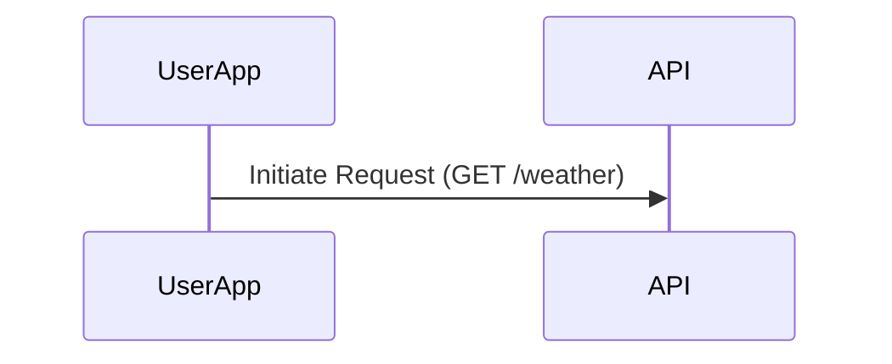
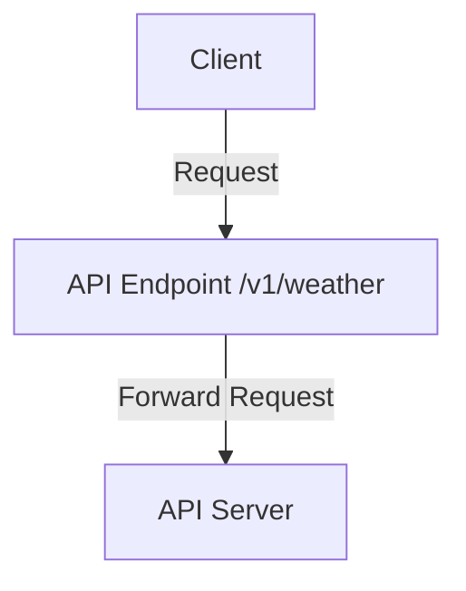
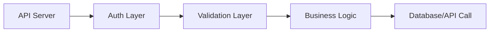
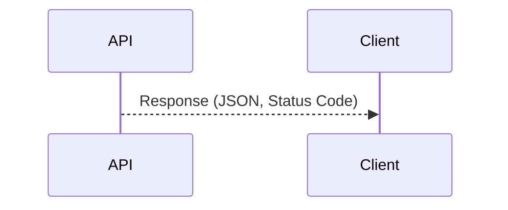
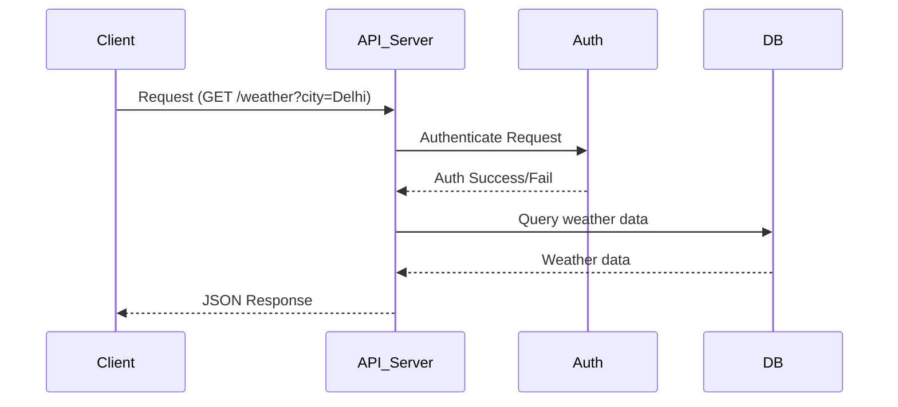

# 🚦 Working of an API: Deep Dive with Diagrams

---

APIs (Application Programming Interfaces) are the backbone of modern software communication. They enable different systems to interact, share data, and trigger actions. Let’s explore the working of an API in detail, step by step, with technical theory and diagrams.

---

## 1. Request Initiation

**Theory:**

- The client (browser, mobile app, IoT device, or another server) initiates a request to the API, typically using HTTP/HTTPS.
- The request includes:
	- **Method:** GET, POST, PUT, DELETE, PATCH, etc.
	- **Headers:** Metadata (e.g., authentication tokens, content type).
	- **Body:** Data payload (for POST/PUT requests).
- Requests can be synchronous (wait for response) or asynchronous (callback/webhook).

**Example:**
```http
GET https://api.example.com/v1/weather?city=Delhi
Content-Type: application/json
Authorization: Bearer <token>
```

**Diagram:**


---

## 2. API Endpoint

**Theory:**

- The request is directed to a specific API endpoint (URL) that represents a resource or service.
- Endpoints are organized by resource type and versioning (e.g., /v1/users, /v2/products).
- Endpoints may require authentication and support query parameters for filtering/sorting.

**Example:**
- `/v1/weather?city=Delhi` is an endpoint for weather data in Delhi.

**Diagram:**



---

## 3. Request Processing

**Theory:**

- The API server receives the request and processes it through several layers:
	- **Authentication:** Verifies user identity (API key, OAuth, JWT).
	- **Validation:** Checks request format, required fields, and permissions.
	- **Business Logic:** Executes core functions (calculations, rules).
	- **Database/Service Calls:** Fetches or updates data from databases or external services.
- May include logging, caching, and error handling.

**Example:**
- The server checks if the city exists, validates the token, fetches weather data from a database or external API.

**Diagram:**


---

## 4. Response Generation

**Theory:**

- After processing, the API generates a response:
	- **Status Code:** 200 (OK), 201 (Created), 400 (Bad Request), 404 (Not Found), 500 (Server Error), etc.
	- **Headers:** Content-Type, CORS, etc.
	- **Body:** Data in JSON, XML, or other formats.
- The response is sent back to the client, which then processes or displays the data.

**Example:**
```json
{
	"city": "Delhi",
	"temperature": 34,
	"condition": "Sunny"
}
```

**Diagram:**


---

## 5. End-to-End API Workflow

**Diagram:**


---

## Key Takeaways

- APIs follow a multi-step workflow: request initiation, endpoint targeting, layered processing, and response.
- Each step involves specific protocols, logic, and data formats for reliability and security.
- Diagrams help visualize the flow and interactions between components.
- Understanding this flow is essential for designing, debugging, and consuming APIs effectively.

---

> **APIs are the backbone of digital ecosystems, powering everything from mobile apps to cloud platforms!**

---

> **APIs are the backbone of modern software communication!**
