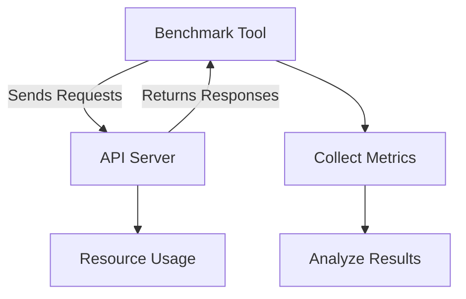
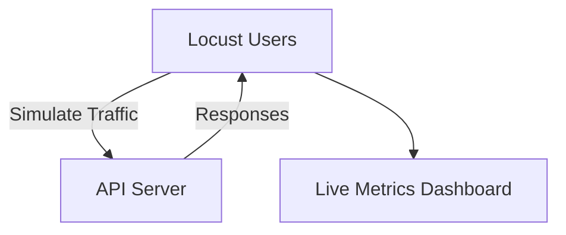

# 🚦 Benchmarking APIs

---

## 📊 What is Benchmarking?

**Benchmarking** is the process of systematically measuring the performance of your API under controlled conditions. The goal is to understand how your API behaves under different loads, identify bottlenecks, and ensure it meets performance requirements.

**Why Benchmark?**
- **Performance Validation:** Ensure your API meets latency and throughput targets.
- **Scalability Assessment:** Understand how your API performs as load increases.
- **Regression Detection:** Identify if new changes degrade performance.
- **Capacity Planning:** Estimate hardware or cloud resources needed for expected traffic.
- **User Experience:** Ensure fast and reliable responses for end users.

---

## 🧩 Key Metrics in API Benchmarking

- **Response Time (Latency):** Time taken to process a request (mean, median, percentiles like P95/P99).
- **Throughput (Requests per Second, RPS):** Number of requests handled per second.
- **Error Rate:** Percentage of failed requests.
- **Concurrency:** Number of simultaneous users or requests.
- **Resource Utilization:** CPU, memory, and network usage during tests.



---

## 🛠️ Benchmarking Tools

- **Locust:** Python-based, supports user scenarios and distributed load.
- **Apache Bench (ab):** Simple CLI tool for quick tests.
- **wrk:** High-performance, scriptable HTTP benchmarking.
- **JMeter:** GUI-based, supports complex workflows and reporting.
- **k6:** Modern, scriptable, and cloud-friendly.

---

## 🚀 Example: Benchmarking with `ab` (Apache Bench)

```bash
ab -n 1000 -c 50 http://localhost:8000/items/
```
- `-n 1000`: Total number of requests.
- `-c 50`: Number of concurrent requests.

**Sample Output:**
```
Requests per second:    500.00 [#/sec] (mean)
Time per request:       100.0 [ms] (mean)
Failed requests:        0
```

---

## 🐍 Example: Benchmarking with Locust

**locustfile.py**
```python
from locust import HttpUser, task

class MyUser(HttpUser):
    @task
    def get_items(self):
        self.client.get("/items/")
```
**Run Locust:**
```bash
locust -f locustfile.py --host=http://localhost:8000
```
Open the web UI, set number of users and spawn rate, and observe live metrics.

---

## 📈 Visualizing Benchmark Results

**Theory:**  
Visualization helps spot trends, bottlenecks, and anomalies in performance data.


- **Line charts:** Show response time over time.
- **Histograms:** Show distribution of latencies.
- **Bar charts:** Compare throughput across endpoints.

---

## ✅ Advantages and Disadvantages of Benchmarking

**Advantages:**
- **Objective Measurement:** Provides quantitative, repeatable data on API performance.
- **Identifies Bottlenecks:** Pinpoints slow endpoints, inefficient code, or infrastructure limits.
- **Regression Detection:** Quickly reveals if new code changes degrade performance.
- **Capacity Planning:** Informs decisions about scaling infrastructure and resource allocation.
- **Improves User Experience:** Ensures APIs remain fast and reliable under expected and peak loads.
- **Supports SLAs:** Helps meet service-level agreements for latency, throughput, and uptime.
- **Baseline Establishment:** Creates a reference point for future optimizations and comparisons.

**Disadvantages:**
- **Environment Sensitivity:** Results can vary greatly between local, staging, and production environments; network and hardware differences may skew results.
- **Synthetic Workloads:** Benchmarks may not fully represent real-world usage patterns or user behavior.
- **Resource Intensive:** Large-scale benchmarks can consume significant resources and may impact other systems if run on shared infrastructure.
- **Complexity:** Setting up realistic, automated, and repeatable benchmarks can be challenging and time-consuming.
- **False Confidence:** Good benchmark results do not guarantee real-world performance if scenarios are unrealistic or incomplete.
- **Maintenance Overhead:** Benchmark scripts and scenarios must be updated as APIs evolve.

---

## 📏 Metrics for Benchmarking

- **Response Time (Latency):**  
  Measures how long it takes for the API to respond to a request. Key statistics include:
  - **Average (Mean) Latency:** Overall average response time.
  - **Median Latency:** The middle value, less affected by outliers.
  - **Percentiles (P95, P99):** Time within which 95% or 99% of requests are completed, highlighting worst-case scenarios.
- **Throughput (Requests per Second, RPS):**  
  Number of requests the API can handle per second.
- **Error Rate:**  
  Percentage of failed or erroneous responses (e.g., HTTP 5xx, 4xx).
- **Concurrency:**  
  Number of simultaneous users or requests being handled.
- **Resource Utilization:**  
  CPU, memory, disk, and network usage during the test.
- **Time to First Byte (TTFB):**  
  Time until the first byte of the response is received by the client.
- **Max/Min Response Time:**  
  Outlier detection for slowest and fastest responses.
- **Requests Distribution:**  
  How requests are distributed across endpoints or users.

---

## 🛠️ Tools for Benchmarking

| Tool         | Type         | Strengths                        |
|--------------|--------------|----------------------------------|
| ab           | CLI          | Simple, quick, easy to use       |
| wrk          | CLI          | High performance, scriptable     |
| Locust       | Python/GUI   | User scenarios, distributed      |
| JMeter       | GUI          | Complex workflows, reporting     |
| k6           | Scriptable   | Modern, cloud-native             |

**Additional Notes:**
- **ab (Apache Bench):** Great for quick, simple load tests but limited in scenario complexity.
- **wrk:** Supports Lua scripting for custom scenarios and high concurrency.
- **Locust:** Write user behavior in Python, supports distributed load generation, real-time web UI.
- **JMeter:** Visual interface, supports complex workflows, assertions, and reporting.
- **k6:** Modern scripting (JavaScript), integrates with CI/CD, cloud execution options.

---

## 🐍 Locust Demo

**Locust** is a Python-based load testing tool that allows you to define user behavior in code and simulate thousands of concurrent users.

**locustfile.py**
```python
from locust import HttpUser, task

class MyUser(HttpUser):
    @task
    def get_items(self):
        self.client.get("/items/")
```
**How to Run:**
```bash
locust -f locustfile.py --host=http://localhost:8000
```
- Open the Locust web UI in your browser (usually at http://localhost:8089).
- Set the number of users and spawn rate.
- Observe live metrics such as RPS, response times, and failures.
- Download reports and analyze performance trends.

**Locust Features:**
- Write complex user flows in Python.
- Simulate thousands of users from multiple machines.
- Real-time charts for requests per second, response time, and failures.
- Supports distributed and headless (CLI-only) modes.

**Diagram:**


---

## 🏆 Best Practices for API Benchmarking

- **Test in Production-like Environments:**  
  Run benchmarks in environments that closely resemble production (hardware, network, data).
- **Use Realistic Data and Scenarios:**  
  Simulate actual user behavior, data patterns, and request distributions.
- **Warm Up the System:**  
  Run a warm-up phase before measuring to avoid cold start effects (e.g., JIT compilation, cache misses).
- **Monitor Resource Usage:**  
  Track CPU, memory, disk, and network usage during tests to spot bottlenecks and saturation points.
- **Analyze Percentiles:**  
  Don’t rely only on averages; look at P95/P99 latencies for worst-case performance and user experience.
- **Repeat Tests:**  
  Run benchmarks multiple times to account for variability and ensure consistency.
- **Automate Benchmarking:**  
  Integrate into CI/CD pipelines for continuous performance monitoring and regression detection.
- **Document Findings:**  
  Record test parameters, results, and any changes made for future reference and reproducibility.
- **Scale Gradually:**  
  Increase load stepwise to observe system behavior at different thresholds and avoid sudden overload.
- **Combine with Profiling:**  
  Use profiling tools alongside benchmarking to diagnose root causes of slowdowns and optimize hot spots.
- **Isolate Variables:**  
  Change one parameter at a time (e.g., concurrency, payload size) to understand its impact on performance.

---

Benchmarking is essential for understanding and improving the real-world performance of your APIs. By measuring, analyzing, and optimizing, you ensure your FastAPI applications are robust, scalable, and ready for production