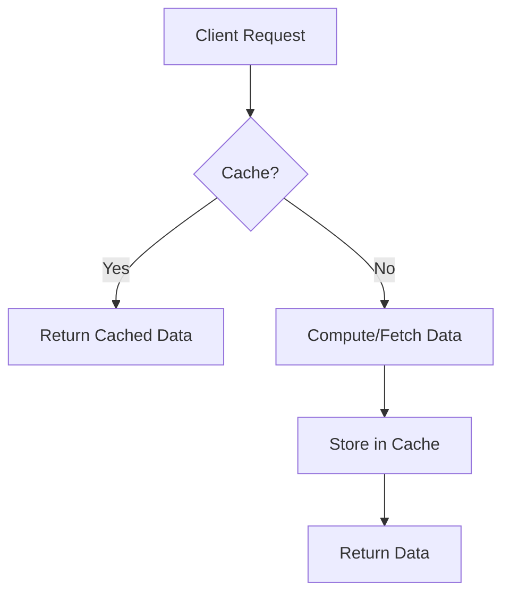
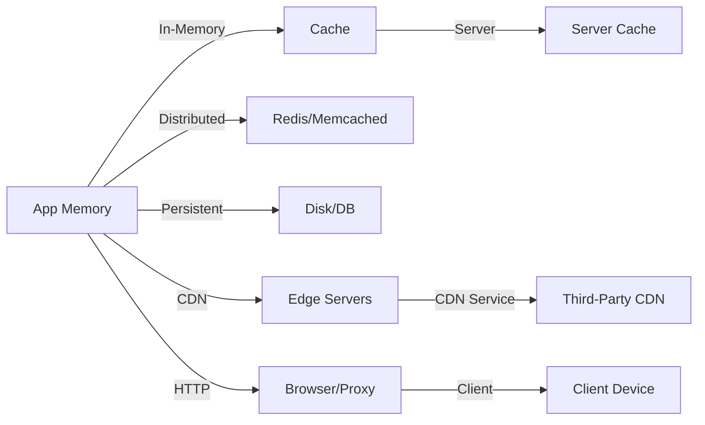
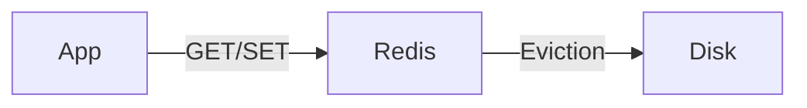
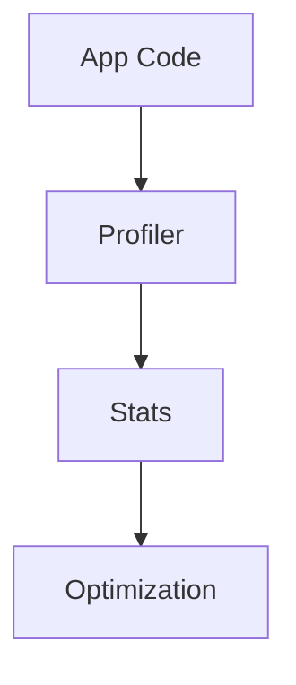
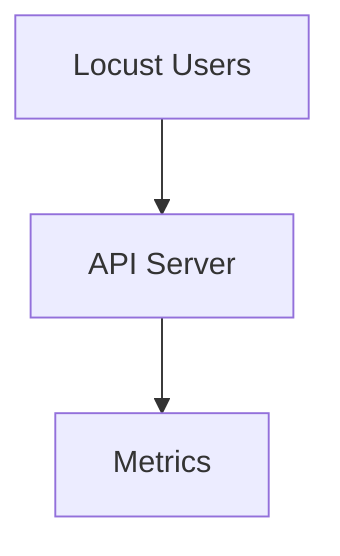
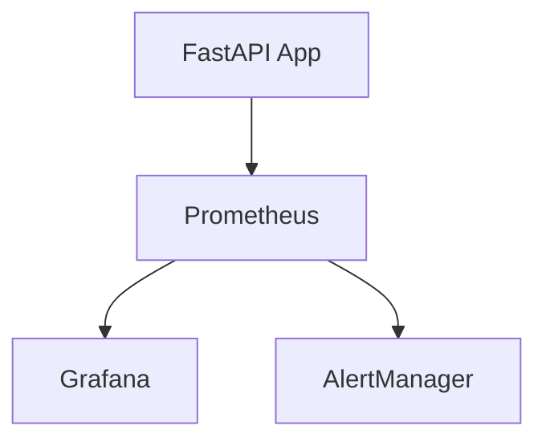

# 🚀 Comprehensive Guide: Caching, Profiling, Benchmarking & Monitoring in FastAPI

---

## 📦 Caching and Its Importance

**Theory:**  
Caching is the process of storing frequently accessed data in a fast-access layer (memory, distributed cache) to reduce latency and computational cost. It leverages the principle of *locality of reference*—recently or frequently used data is likely to be needed again.

**Importance:**  
- **Performance:** Reduces response time by serving data from cache.
- **Scalability:** Handles more requests with less backend load.
- **Cost Efficiency:** Minimizes expensive computations and database hits.
- **User Experience:** Faster APIs lead to happier users.



---

## 🎯 Caching Use Cases

- **Database Query Results:** Cache expensive or frequently repeated queries.
- **External API Responses:** Store results from slow or rate-limited APIs.
- **ML Predictions:** Cache model outputs for identical inputs.
- **Session Data:** Store user sessions for quick access.
- **Static Content:** Cache rarely changing resources (e.g., config, metadata).

---

## 🗂️ Types of Caching

**1. In-Memory Caching:**  
Stores data in the application's memory (e.g., Python dict, lru_cache). Fastest, but limited to a single process and lost on restart.

**2. Distributed Caching:**  
Uses external systems (e.g., Redis, Memcached) to share cache across multiple servers or processes. Persistent and scalable.

**3. Persistent Caching:**  
Stores cache on disk or database for durability across restarts (e.g., file-based cache, database-backed cache).

**4. Content Delivery Network (CDN) Caching:**  
Caches static assets (images, scripts) at edge locations close to users for faster delivery.

**5. Application-Level Caching:**  
Implements caching logic within the application code, such as function memoization or result caching.

**6. HTTP Caching:**  
Uses HTTP headers (Cache-Control, ETag) to instruct browsers and proxies to cache responses.

**7. Client-Side Caching:**  
Data is cached on the user's device (browser, mobile app). Reduces repeated network requests and improves perceived speed. Controlled via HTTP headers and local storage.

**8. Server-Side Caching:**  
Data is cached on the server (web server, API server, backend). Used for dynamic content, database queries, and computations. Improves scalability and reduces backend load.

**9. CDN Caching:**  
Third-party CDN services cache static and dynamic content geographically close to users. Offloads traffic from origin servers and accelerates global delivery.



---

## 🔑 Key Considerations for Caching

- **Cache Invalidation:** Decide when to remove or refresh stale data (TTL, manual, event-based).
- **Consistency:** Ensure cache reflects current state after updates.
- **Eviction Policy:** Choose how to remove old data (LRU, LFU, FIFO).
- **Sizing:** Balance cache size with available memory.
- **Security:** Avoid caching sensitive data unless encrypted.

---

## 🛠️ Common Tools for Caching

| Tool         | Type         | Use Case                  |
|--------------|--------------|---------------------------|
| Python dict  | In-memory    | Simple, single-process    |
| lru_cache    | In-memory    | Function memoization      |
| Redis        | Distributed  | Multi-process, persistent |
| Memcached    | Distributed  | Fast, ephemeral           |

---

## 🔴 Caching with Redis

**Theory:**  
Redis is an in-memory, distributed key-value store supporting rich data structures (strings, hashes, lists, sets, sorted sets). It is widely used for caching due to its speed and scalability.

**Redis Data Structures:**
- **Strings:** Simple key-value pairs.
- **Hashes:** Store objects (e.g., user profiles).
- **Lists:** Queues, stacks.
- **Sets:** Unique collections.
- **Sorted Sets:** Leaderboards, ranking.



**Use Cases:**  
- Session storage, rate limiting, caching API/DB results, pub/sub messaging.

**Setup:**  
- Install Redis (locally or via Docker).
- Connect using a Redis client library.

**FastAPI Integration Example:**
```python
import redis
r = redis.Redis(host='localhost', port=6379)
r.set("key", "value")
```

---

## 🤖 Caching ML Predictions

**Theory:**  
ML predictions can be expensive. By caching outputs for identical inputs (using a hash of features as the key), repeated requests are served instantly.

**Example:**  
```python
def predict(features):
    key = hash(str(features))
    if cache.exists(key):
        return cache.get(key)
    result = model.predict(features)
    cache.set(key, result)
    return result
```

---

## 🗃️ Caching DB Queries

**Theory:**  
Store results of expensive queries in cache. On subsequent requests, serve from cache if available.

**Example:**  
```python
def get_report(params):
    key = f"report:{params}"
    if cache.exists(key):
        return cache.get(key)
    result = db.query(params)
    cache.set(key, result)
    return result
```

---

## 🌐 Caching External API Calls

**Theory:**  
Reduce latency and avoid rate limits by caching responses from external APIs.

**Example:**  
```python
def get_weather(city):
    key = f"weather:{city}"
    if cache.exists(key):
        return cache.get(key)
    data = call_external_api(city)
    cache.set(key, data, ttl=3600)
    return data
```

---

## 🧭 Profiling FastAPI Apps

**Theory:**  
Profiling analyzes where your app spends time and resources, helping you find bottlenecks and optimize performance.



---

### ⏱️ Profiling with TIME

- Use `time` module to measure execution duration.
- Simple, but only gives total time.

**Example:**  
```python
start = time.time()
do_work()
print("Elapsed:", time.time() - start)
```

---

### 📊 Profiling with cProfile

- Built-in Python profiler.
- Tracks function calls, time spent per function.
- Generates detailed reports.

**Example:**  
```python
import cProfile
cProfile.run('do_work()')
```

---

### 🧬 Profiling with line_profiler

- Measures execution time per line of code.
- Useful for pinpointing slow lines in functions.

**Example:**  
```python
@profile
def slow_func():
    ...
```

---

## 📈 Benchmarking APIs

**Theory:**  
Benchmarking measures API performance under load (response time, throughput, error rate).

**Advantages:**  
- Validates scalability.
- Detects regressions.
- Guides infrastructure planning.

**Metrics:**  
- Response time (mean, median, percentiles)
- Requests per second (RPS)
- Error rate

**Tools:**  
- **Locust:** Python-based, user scenarios.
- **Apache Bench (ab):** Simple CLI.
- **wrk:** High-performance, scripting.
- **JMeter:** GUI, complex tests.

**Locust Demo:**  
Define user behavior, run tests, analyze results.



**Best Practices:**  
- Test in production-like environments.
- Use realistic data and scenarios.
- Monitor resource usage.
- Analyze percentiles, not just averages.

---

## 📡 Monitoring APIs

**Theory:**  
Monitoring tracks API health, performance, and usage over time. Enables alerting and troubleshooting.

**Prometheus:**  
- Time-series database.
- Scrapes metrics from `/metrics` endpoint.
- Uses PromQL for queries.

**Prometheus with FastAPI:**  
Expose metrics using `prometheus_client`.

**Grafana:**  
- Visualizes Prometheus metrics.
- Builds dashboards and alerts.

**Integration Diagram:**


**Best Practices:**  
- Monitor latency, error rates, resource usage.
- Set up alerts for anomalies.
- Use dashboards for visibility.

---

This guide covers the theory, use cases, types, and practical considerations for caching, profiling, benchmarking, and monitoring in FastAPI, with concise examples