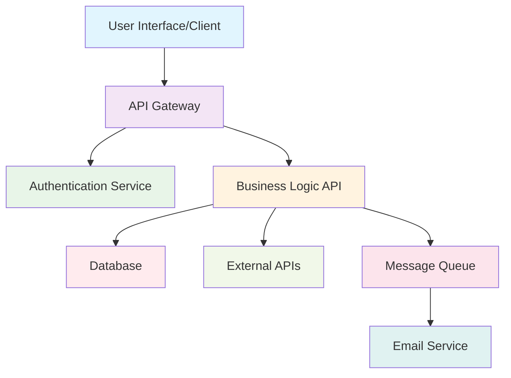
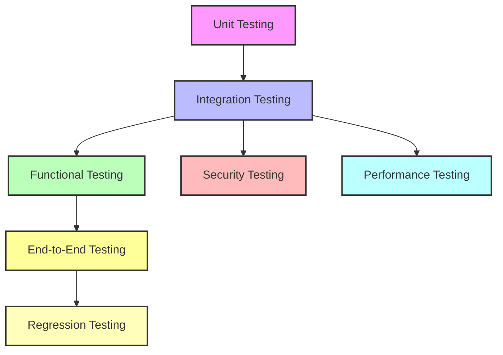

## **End-to-End Testing (E2E)**

**What is it?**  
End-to-End testing validates complete user workflows by testing the entire application stack from the user interface down to the database and back. It simulates real user scenarios to ensure all integrated components work together seamlessly.

**Example:**  
Test the complete user registration flow: user fills out form → API validates data → saves to database → sends confirmation email → user receives welcome message.

```python
def test_complete_user_registration():
    # Step 1: Register new user
    user_data = {
        "username": "testuser",
        "email": "test@example.com",
        "password": "SecurePass123"
    }
    response = client.post("/register", json=user_data)
    assert response.status_code == 201
    
    # Step 2: Verify user can login
    login_response = client.post("/login", json={
        "username": "testuser",
        "password": "SecurePass123"
    })
    assert login_response.status_code == 200
    token = login_response.json()["access_token"]
    
    # Step 3: Access protected endpoint with token
    headers = {"Authorization": f"Bearer {token}"}
    profile_response = client.get("/profile", headers=headers)
    assert profile_response.status_code == 200
    assert profile_response.json()["username"] == "testuser"
```

**When to use:**  
- Before major releases or deployments to production
- To validate critical user journeys (signup, checkout, data processing)
- After significant system changes or integrations
- As part of acceptance testing with stakeholders
- When testing across multiple services or microservices

**Why it matters:**  
E2E testing ensures your entire system delivers the expected user experience, catching integration issues that individual component tests might miss.

---

### 🔄 **E2E vs Other Testing Types**

| Aspect | E2E Testing | Integration Testing | Unit Testing |
|--------|-------------|-------------------|--------------|
| **Scope** | Entire user workflow | Component interactions | Individual functions |
| **Environment** | Production-like | Controlled/isolated | Mocked dependencies |
| **Duration** | Slow (minutes) | Medium (seconds) | Fast (milliseconds) |
| **Maintenance** | High | Medium | Low |
| **Confidence** | Highest | Medium | Lowest |

---

### 🏗️ **E2E Testing Architecture**



**E2E tests validate the entire flow from A to H!**

---

### 🛠️ **E2E Testing Strategies**

#### **1. User Journey Testing**
Test complete workflows that mirror real user behavior.

```python
def test_e2e_order_workflow():
    # User browses products
    products_response = client.get("/products")
    assert products_response.status_code == 200
    
    # User adds item to cart
    cart_response = client.post("/cart/add", json={
        "product_id": 1,
        "quantity": 2
    })
    assert cart_response.status_code == 200
    
    # User proceeds to checkout
    checkout_response = client.post("/checkout", json={
        "payment_method": "credit_card",
        "shipping_address": "123 Main St"
    })
    assert checkout_response.status_code == 200
    order_id = checkout_response.json()["order_id"]
    
    # Verify order status
    order_response = client.get(f"/orders/{order_id}")
    assert order_response.json()["status"] == "confirmed"
```

#### **2. Cross-Service Testing**
Test interactions between multiple microservices.

```python
def test_e2e_payment_processing():
    # Create order in Order Service
    order_data = {"user_id": 1, "amount": 99.99}
    order_response = client.post("/orders", json=order_data)
    order_id = order_response.json()["order_id"]
    
    # Process payment via Payment Service
    payment_response = client.post("/payments", json={
        "order_id": order_id,
        "card_number": "4111111111111111",
        "amount": 99.99
    })
    assert payment_response.status_code == 200
    
    # Verify inventory updated in Inventory Service
    inventory_response = client.get("/inventory/check")
    # Assert inventory was decremented
    
    # Verify notification sent via Notification Service
    notifications_response = client.get(f"/notifications/user/1")
    # Assert payment confirmation was sent
```

#### **3. Data Flow Testing**
Verify data consistency across the entire system.

```python
def test_e2e_data_consistency():
    # Create user
    user_response = client.post("/users", json={
        "username": "datatest",
        "email": "data@test.com"
    })
    user_id = user_response.json()["user_id"]
    
    # Update user profile
    client.put(f"/users/{user_id}", json={
        "bio": "Updated bio",
        "location": "New York"
    })
    
    # Verify changes reflected in search index
    search_response = client.get(f"/search/users?q=datatest")
    user_in_search = search_response.json()["users"][0]
    assert user_in_search["bio"] == "Updated bio"
    
    # Verify changes reflected in recommendations
    recommendations_response = client.get(f"/recommendations/{user_id}")
    # Assert recommendations updated based on new location
```

---

### 📊 **E2E Testing Environments**

#### **Production-Like Environment**
```python
# config/test_config.py
E2E_CONFIG = {
    "database_url": "postgresql://test_db:5432/e2e_tests",
    "redis_url": "redis://test_redis:6379",
    "external_apis": {
        "payment_service": "https://staging-payment.example.com",
        "email_service": "https://staging-email.example.com"
    },
    "feature_flags": {
        "new_checkout_flow": True,
        "beta_recommendations": False
    }
}
```

#### **Test Data Management**
```python
import pytest
from database import create_test_data, cleanup_test_data

@pytest.fixture(scope="session")
def e2e_test_data():
    # Setup: Create test users, products, etc.
    test_data = create_test_data()
    yield test_data
    # Teardown: Clean up after tests
    cleanup_test_data(test_data)

def test_e2e_with_test_data(e2e_test_data):
    user = e2e_test_data["users"]["regular_user"]
    # Use pre-created test data
    response = client.get(f"/users/{user.id}")
    assert response.status_code == 200
```

---

### 🚀 **E2E Testing Tools & Frameworks**

#### **API-First E2E Testing**
```python
# Using pytest + requests
import pytest
import requests

class TestE2EAPIWorkflow:
    base_url = "https://api.staging.example.com"
    
    def test_complete_api_workflow(self):
        session = requests.Session()
        
        # Step 1: Authenticate
        auth_response = session.post(f"{self.base_url}/auth/login", json={
            "username": "testuser",
            "password": "testpass"
        })
        assert auth_response.status_code == 200
        
        # Session now has auth cookies/tokens
        
        # Step 2: Perform business operations
        create_response = session.post(f"{self.base_url}/resources", json={
            "name": "Test Resource",
            "type": "important"
        })
        assert create_response.status_code == 201
        
        # Continue testing the full workflow...
```

#### **Browser-Based E2E Testing**
```python
# Using Selenium WebDriver
from selenium import webdriver
from selenium.webdriver.common.by import By

class TestE2EWebApp:
    def setup_method(self):
        self.driver = webdriver.Chrome()
        self.driver.get("https://staging.example.com")
    
    def test_complete_user_journey(self):
        # User logs in via web interface
        self.driver.find_element(By.ID, "username").send_keys("testuser")
        self.driver.find_element(By.ID, "password").send_keys("testpass")
        self.driver.find_element(By.ID, "login-btn").click()
        
        # User performs actions that trigger API calls
        self.driver.find_element(By.ID, "create-resource-btn").click()
        
        # Verify API response reflected in UI
        success_message = self.driver.find_element(By.CLASS_NAME, "success-message")
        assert "Resource created successfully" in success_message.text
    
    def teardown_method(self):
        self.driver.quit()
```

---

### 🎯 **E2E Testing Best Practices**

#### **1. Test Pyramid Balance**
```
     E2E Tests (Few)
    ─────────────────
   Integration Tests (More)
  ─────────────────────────
 Unit Tests (Most)
```

**Why?** E2E tests are slow and brittle. Use them sparingly for critical paths.

#### **2. Stable Test Data**
```python
# Good: Use dedicated test data
def test_e2e_order_flow():
    test_user = create_test_user("e2e_test_user")
    test_product = create_test_product("e2e_test_product")
    # Test with known, controlled data

# Bad: Rely on production-like data that might change
def test_e2e_order_flow():
    # Assumes user ID 123 exists and has specific properties
    response = client.get("/users/123")
```

#### **3. Idempotent Tests**
```python
def test_e2e_user_registration():
    # Cleanup before test
    cleanup_user("test@e2e.com")
    
    # Run test
    response = client.post("/register", json={
        "email": "test@e2e.com",
        "password": "testpass"
    })
    assert response.status_code == 201
    
    # Cleanup after test
    cleanup_user("test@e2e.com")
```

#### **4. Meaningful Error Messages**
```python
def test_e2e_checkout_flow():
    # Add context to assertions
    response = client.post("/checkout", json=checkout_data)
    assert response.status_code == 200, f"Checkout failed: {response.json()}"
    
    order_id = response.json().get("order_id")
    assert order_id is not None, "Order ID not returned from checkout"
    
    # Verify order in database
    order = get_order_from_db(order_id)
    assert order.status == "confirmed", f"Expected order status 'confirmed', got '{order.status}'"
```

---

### 📈 **E2E Testing Challenges & Solutions**

| Challenge | Solution |
|-----------|----------|
| **Slow execution** | Run in parallel, prioritize critical paths |
| **Flaky tests** | Add retry logic, better waits, stable test data |
| **Environment setup** | Use containers, infrastructure as code |
| **Test maintenance** | Page object pattern, shared utilities |
| **Data dependencies** | Test data factories, cleanup automation |

#### **Example: Handling Flaky Tests**
```python
import time
import pytest
from tenacity import retry, wait_exponential, stop_after_attempt

@retry(wait=wait_exponential(multiplier=1, min=4, max=10), stop=stop_after_attempt(3))
def test_e2e_with_retry():
    # Test that might be flaky due to timing issues
    response = client.post("/heavy-processing", json=data)
    assert response.status_code == 200
    
    # Wait for async processing
    time.sleep(2)
    
    status_response = client.get(f"/status/{response.json()['job_id']}")
    assert status_response.json()["status"] == "completed"
```

---

### 🔧 **E2E Test Implementation Example**

Here's a complete E2E test for a loan application system:

```python
import pytest
from fastapi.testclient import TestClient
from app.main import app
from app.database import get_test_db
from app.email import EmailService

client = TestClient(app)

class TestE2ELoanApplication:
    
    def test_complete_loan_application_journey(self):
        # Step 1: User registration
        registration_data = {
            "email": "borrower@test.com",
            "password": "SecurePass123",
            "full_name": "John Doe",
            "phone": "555-0123"
        }
        reg_response = client.post("/auth/register", json=registration_data)
        assert reg_response.status_code == 201
        user_id = reg_response.json()["user_id"]
        
        # Step 2: User login and get token
        login_response = client.post("/auth/login", json={
            "email": "borrower@test.com",
            "password": "SecurePass123"
        })
        assert login_response.status_code == 200
        token = login_response.json()["access_token"]
        headers = {"Authorization": f"Bearer {token}"}
        
        # Step 3: Submit loan application
        loan_application = {
            "amount": 50000,
            "purpose": "home_improvement",
            "employment_status": "employed",
            "annual_income": 75000,
            "credit_score": 720
        }
        app_response = client.post("/loans/apply", json=loan_application, headers=headers)
        assert app_response.status_code == 201
        application_id = app_response.json()["application_id"]
        
        # Step 4: Check application status
        status_response = client.get(f"/loans/{application_id}", headers=headers)
        assert status_response.status_code == 200
        assert status_response.json()["status"] == "under_review"
        
        # Step 5: Admin approval (simulate internal process)
        admin_token = self.get_admin_token()
        admin_headers = {"Authorization": f"Bearer {admin_token}"}
        approval_response = client.put(
            f"/admin/loans/{application_id}/approve",
            json={"decision": "approved", "loan_amount": 45000},
            headers=admin_headers
        )
        assert approval_response.status_code == 200
        
        # Step 6: Verify user receives approval notification
        notifications_response = client.get("/notifications", headers=headers)
        notifications = notifications_response.json()["notifications"]
        approval_notification = next(
            (n for n in notifications if n["type"] == "loan_approved"), None
        )
        assert approval_notification is not None
        assert approval_notification["application_id"] == application_id
        
        # Step 7: User accepts loan terms
        acceptance_response = client.post(
            f"/loans/{application_id}/accept",
            json={"terms_accepted": True},
            headers=headers
        )
        assert acceptance_response.status_code == 200
        
        # Step 8: Verify loan account created
        accounts_response = client.get("/accounts", headers=headers)
        accounts = accounts_response.json()["accounts"]
        loan_account = next((a for a in accounts if a["type"] == "loan"), None)
        assert loan_account is not None
        assert loan_account["balance"] == 45000
        
        # Step 9: Cleanup test data
        self.cleanup_test_data(user_id, application_id)
    
    def get_admin_token(self):
        # Helper method to get admin authentication
        admin_login = client.post("/auth/login", json={
            "email": "admin@test.com",
            "password": "AdminPass123"
        })
        return admin_login.json()["access_token"]
    
    def cleanup_test_data(self, user_id, application_id):
        # Clean up test data to ensure test idempotency
        client.delete(f"/test/cleanup/user/{user_id}")
        client.delete(f"/test/cleanup/application/{application_id}")
```

---

### 📋 **E2E Testing Checklist**

✅ **Planning**
- [ ] Identify critical user journeys
- [ ] Map out system dependencies
- [ ] Define test environment requirements

✅ **Implementation**
- [ ] Create stable test data
- [ ] Implement proper setup/teardown
- [ ] Add meaningful assertions and error messages
- [ ] Handle async operations properly

✅ **Execution**
- [ ] Run tests in isolated environment
- [ ] Monitor test execution time
- [ ] Capture screenshots/logs on failures
- [ ] Implement retry mechanisms for flaky tests

✅ **Maintenance**
- [ ] Regular test review and updates
- [ ] Remove outdated tests
- [ ] Optimize slow tests
- [ ] Update tests when workflows change

---

**Reflect:**  
- Which critical user journeys in your application would benefit from E2E testing?
- How can you balance comprehensive E2E coverage with test execution speed?
- What infrastructure do you need to support reliable E2E testing?

## 🗺️ Visual Overview

Here's a diagram showing how these testing types fit together in your API workflow:



---

## 🧭 When to Use Each Testing Method

| Testing Type      | Use When...                                      | Example Scenario                       |
|-------------------|--------------------------------------------------|----------------------------------------|
| Unit              | Building or refactoring endpoints                | New `/add` endpoint                    |
| Integration       | Connecting modules/services                      | API + database interaction             |
| Functional        | Validating business logic                        | User authentication flow               |
| **End-to-End**    | **Validating complete user workflows**          | **Full checkout process, user onboarding** |
| Security          | Handling sensitive data or public APIs           | Login, payments, user data             |
| Performance       | Preparing for high traffic or scaling            | Black Friday sale, new feature launch  |
| Regression        | Updating codebase or fixing bugs                 | After bug fixes or feature updates     |
