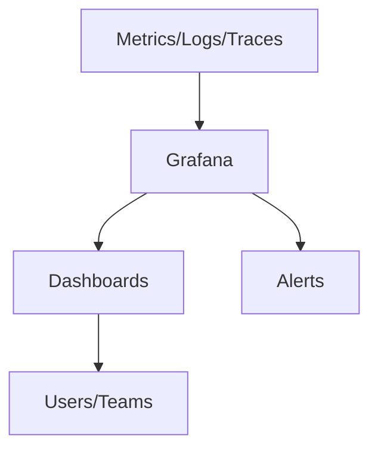
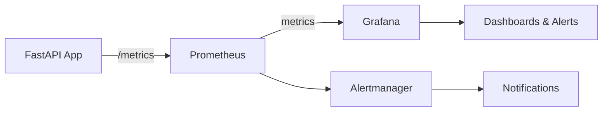

# 📊 Grafana

---

## 🧭 What is Grafana?

**Grafana** is an open-source analytics and interactive visualization platform designed for monitoring, observability, and data exploration. It enables users to query, visualize, alert on, and analyze metrics, logs, and traces from a wide variety of data sources in real time.

---

## 🧩 Theoretical Foundations

### Data Source Agnostic

Grafana is not a database itself; instead, it connects to many different data sources such as:
- **Time Series Databases:** Prometheus, InfluxDB, Graphite
- **Log Aggregators:** Loki, Elasticsearch
- **SQL Databases:** MySQL, PostgreSQL, Microsoft SQL Server
- **Cloud Services:** AWS CloudWatch, Google Cloud Monitoring, Azure Monitor

This flexibility allows organizations to centralize monitoring and visualization across their entire stack.

### Visualization and Dashboards

Grafana provides a rich set of visualization options:
- **Time Series Graphs:** For trends and patterns over time.
- **Tables:** For tabular data and logs.
- **Heatmaps:** For density and distribution analysis.
- **Gauges and Bar Charts:** For KPIs and status indicators.
- **Stat Panels:** For single-value metrics.

Dashboards are interactive and support features like zooming, filtering, and templating (variables).

### Alerting

Grafana supports powerful alerting mechanisms:
- **Threshold-based Alerts:** Trigger notifications when metrics cross defined thresholds.
- **Multi-Channel Notifications:** Email, Slack, PagerDuty, Microsoft Teams, and more.
- **Alert Rules and Silence:** Define complex rules and mute alerts during maintenance.

### User Management and Collaboration

- **Teams and Permissions:** Fine-grained access control for dashboards and data sources.
- **Sharing:** Dashboards and panels can be shared via links, snapshots, or embedded in other tools.
- **Annotations:** Users can add notes to dashboards to mark events or incidents.

### Extensibility

- **Plugins:** Grafana supports plugins for new data sources, visualizations, and apps.
- **API and Provisioning:** Dashboards and data sources can be managed programmatically for automation and reproducibility.

---

## 🏗️ How Grafana Works

Grafana acts as a visualization and alerting layer on top of your metrics and logs infrastructure. It queries data sources in real time and renders dashboards for users.



- **Metrics/Logs/Traces:** Data is collected by systems like Prometheus, Loki, or databases.
- **Grafana:** Connects to these sources, queries data, and renders dashboards.
- **Dashboards:** Visualize trends, anomalies, and KPIs.
- **Alerts:** Trigger notifications when thresholds are crossed.
- **Users/Teams:** Collaborate and share insights.

---

## 🚦 Example: Using Grafana with Prometheus

1. **Prometheus** scrapes metrics from your application (e.g., FastAPI `/metrics` endpoint).
2. **Grafana** is configured to use Prometheus as a data source.
3. **Dashboards** are created in Grafana to visualize metrics like request rate, error rate, and latency.
4. **Alerts** are set up in Grafana to notify you if, for example, error rates spike or latency exceeds a threshold.

**Sample Prometheus Query in Grafana:**
```
rate(request_count[5m])
```
This shows the rate of requests over the last 5 minutes.

---

## 🖥️ Example Dashboard Panels

- **Time Series Graph:** Visualize request rate, latency, or CPU usage over time.
- **Gauge:** Show current memory usage or active users.
- **Table:** List error logs or slow endpoints.
- **Heatmap:** Visualize latency distribution.

---

## 🏆 Best Practices

- **Use Variables:** Make dashboards dynamic and reusable.
- **Organize Dashboards:** Group related panels and use folders for large environments.
- **Set Alerts:** Proactively notify teams of issues.
- **Secure Access:** Use authentication and permissions to protect sensitive data.
- **Automate Setup:** Use provisioning files or Grafana’s API for reproducible dashboards.
- **Document Dashboards:** Add descriptions and annotations for clarity.

---

## 🐳 FastAPI with Grafana, Prometheus, and Docker

### Theory

Combining FastAPI, Prometheus, and Grafana using Docker enables a robust, scalable, and portable monitoring stack. Each component plays a distinct role:
- **FastAPI** exposes application metrics (e.g., via `/metrics` endpoint using `prometheus_client`).
- **Prometheus** scrapes these metrics at regular intervals and stores them as time series data.
- **Grafana** queries Prometheus and visualizes the metrics in real-time dashboards.
- **Docker** containerizes each service, making deployment, scaling, and orchestration straightforward and reproducible.

### Example Architecture



### Example: Docker Compose Setup

**docker-compose.yml**
```yaml
version: '3'
services:
  fastapi:
    build: .
    ports:
      - "8000:8000"
  prometheus:
    image: prom/prometheus
    volumes:
      - ./prometheus.yml:/etc/prometheus/prometheus.yml
    ports:
      - "9090:9090"
  grafana:
    image: grafana/grafana
    ports:
      - "3000:3000"
```

**prometheus.yml**
```yaml
scrape_configs:
  - job_name: 'fastapi'
    static_configs:
      - targets: ['fastapi:8000']
```

### FastAPI Metrics Endpoint Example

```python
from fastapi import FastAPI, Response
from prometheus_client import Counter, generate_latest

app = FastAPI()
REQUEST_COUNT = Counter('request_count', 'Total API Requests')

@app.middleware("http")
async def count_requests(request, call_next):
    REQUEST_COUNT.inc()
    return await call_next(request)

@app.get("/metrics")
def metrics():
    return Response(generate_latest(), media_type="text/plain")
```

### Workflow

1. **FastAPI** exposes `/metrics` endpoint with application metrics.
2. **Prometheus** (in Docker) scrapes metrics from FastAPI at regular intervals.
3. **Grafana** (in Docker) connects to Prometheus and visualizes metrics in dashboards.
4. **Alertmanager** (optional) sends notifications if alert rules are triggered.

---

## 📚 Documentation

- [Grafana Documentation](https://grafana.com/docs/)