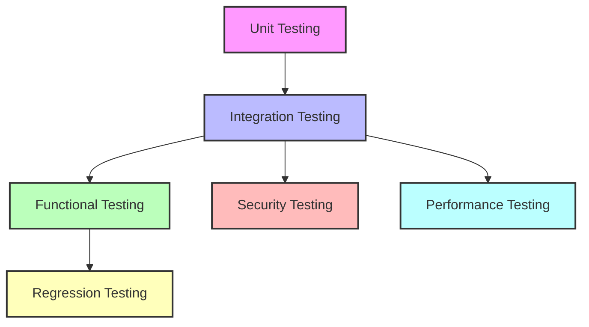

# 🚦 Importance of Testing APIs

Testing APIs is a crucial step in building reliable, secure, and maintainable applications. Let’s explore why API testing matters, its advantages and disadvantages, and key subtopics—all in an interactive, easy-to-understand way!

---

## 🤔 Why Test APIs?

Imagine you’re using a food delivery app. What if the app shows the wrong order, or fails to place your request? These issues often stem from untested APIs. Testing ensures your API works as expected, handles errors gracefully, and delivers a great user experience.

**Reflect:**  
- Have you ever faced a bug in an app that could have been caught by better API testing?
- What would happen if your API returned incorrect data to thousands of users?

---

## 🏆 Advantages of API Testing

- **Reliability:**  
  Confirms your API delivers correct data and behaves as intended.

- **Early Bug Detection:**  
  Finds issues before they reach users, saving time and money.

- **Security:**  
  Identifies vulnerabilities like data leaks, broken authentication, or injection attacks.

- **Performance:**  
  Ensures your API can handle high traffic and responds quickly.

- **Documentation:**  
  Well-tested APIs are easier to document and maintain.

- **Automation:**  
  Automated tests speed up development and deployment.

**Try This:**  
- Write a simple test for your API’s `/login` endpoint. What happens if you send an invalid password?

---

## ⚠️ Disadvantages & Challenges

- **Time Investment:**  
  Writing and maintaining tests takes effort.

- **Complexity:**  
  Testing APIs with many dependencies (databases, external services) can be tricky.

- **False Positives/Negatives:**  
  Poorly written tests may miss bugs or flag working code as broken.

- **Changing Requirements:**  
  Tests need updates when APIs evolve.

**Reflect:**  
- How can you balance thorough testing with fast development?
- What strategies can help keep your tests up-to-date?

---

## 🔍 Types of API Testing (In Depth)

API testing covers several layers, each with its own purpose and approach. Let’s dive deeper into the main types, with simple examples and a visual diagram to clarify how they fit together.

---

## 1. **Unit Testing**

**What is it?**  
Unit testing focuses on individual functions or endpoints, checking if they work as expected in isolation.

**Example:**  
Test if your `/add` endpoint correctly adds two numbers.

```python
def test_add_endpoint():
    response = client.get("/add?a=2&b=3")
    assert response.json() == {"result": 5}
```

**When to use:**  
- During development of new features or endpoints.
- When refactoring code to ensure nothing breaks.
- For logic that doesn’t depend on external systems.

**Why it matters:**  
Catches bugs early and makes refactoring safer.

---

## 2. **Integration Testing**

**What is it?**  
Integration testing checks how different components (like your API and database) work together.

**Example:**  
Test if creating a user via `/users` actually saves the user in the database.

```python
def test_create_user():
    response = client.post("/users", json={"name": "Alice"})
    assert response.status_code == 201
    # Now check if Alice exists in the database
```

**When to use:**  
- After unit tests pass, to verify interactions between modules.
- When connecting to databases, external APIs, or services.
- Before deploying to staging or production.

**Why it matters:**  
Ensures your system works as a whole, not just in parts.

---

## 3. **Functional Testing**

**What is it?**  
Functional testing verifies that the API meets business requirements and behaves as users expect.

**Example:**  
Test if the `/login` endpoint allows access only with correct credentials.

```python
def test_login_success():
    response = client.post("/login", json={"username": "bob", "password": "secure"})
    assert response.status_code == 200
```

**When to use:**  
- Before releasing new features to users.
- To validate user stories or business logic.
- During acceptance testing with stakeholders.

**Why it matters:**  
Confirms your API delivers the features users need.

---

## 4. **Security Testing**

**What is it?**  
Security testing probes for vulnerabilities, ensuring your API protects data and access.

**Example:**  
Test if the API rejects SQL injection attempts.

```python
def test_sql_injection():
    response = client.post("/login", json={"username": "' OR 1=1 --", "password": "hack"})
    assert response.status_code == 401
```

**When to use:**  
- Regularly, especially before public releases.
- After changes to authentication or authorization logic.
- When handling sensitive data or financial transactions.

**Why it matters:**  
Protects your users and business from attacks.

---

## 5. **Performance Testing**

**What is it?**  
Performance testing measures how your API handles load, speed, and stability.

**Example:**  
Simulate 1000 users hitting `/search` at once and measure response times.

**When to use:**  
- Before scaling up or launching to a large audience.
- After major changes to code or infrastructure.
- To identify bottlenecks and optimize resources.

**Why it matters:**  
Ensures your API stays fast and reliable under real-world conditions.

---

## 6. **Regression Testing**

**What is it?**  
Regression testing checks that new changes don’t break existing features.

**Example:**  
After updating the `/profile` endpoint, run all previous tests to ensure nothing else broke.

**When to use:**  
- After every code change, bug fix, or feature addition.
- Before deploying updates to production.
- As part of your CI/CD pipeline.

**Why it matters:**  
Keeps your API stable as it evolves.

---

## 🗺️ Visual Overview

Here’s a diagram showing how these testing types fit together in your API workflow:



---

## 🧭 When to Use Each Testing Method

| Testing Type      | Use When...                                      | Example Scenario                       |
|-------------------|--------------------------------------------------|----------------------------------------|
| Unit              | Building or refactoring endpoints                | New `/add` endpoint                    |
| Integration       | Connecting modules/services                      | API + database interaction             |
| Functional        | Validating business logic                        | User authentication flow               |
| Security          | Handling sensitive data or public APIs           | Login, payments, user data             |
| Performance       | Preparing for high traffic or scaling            | Black Friday sale, new feature launch  |
| Regression        | Updating codebase or fixing bugs                 | After bug fixes or feature updates     |

**Reflect:**  
- Which type of testing do you use most often?  
- Where could you add more coverage in your API testing?
- How can you automate these tests for every code change?

---

## 🛠️ Tools for API Testing

- **Manual Tools:**  
  Postman, Insomnia—great for exploring and debugging APIs.

- **Automated Tools:**  
  Pytest, unittest (Python), JUnit (Java), Mocha (JavaScript).

- **CI/CD Integration:**  
  Run tests automatically on every code change using GitHub Actions, Jenkins, etc.

**Try This:**  
- Use Postman to send a request to your API. What happens if you change the request data?

---

## 💡 Best Practices

- **Test Early & Often:**  
  Don’t wait until the end—write tests as you build.

- **Automate:**  
  Use automated tests for speed and consistency.

- **Cover Edge Cases:**  
  Test for invalid inputs, missing data, and unexpected scenarios.

- **Keep Tests Updated:**  
  Revise tests when your API changes.

- **Monitor Test Results:**  
  Set up alerts for failed tests.

**Reflect:**  
- What’s one thing you can do today to improve your API testing process?

---

## 📝 Summary

API testing is essential for building trustworthy applications. It helps catch bugs, improve security, and deliver a better user experience. While it requires effort, the benefits far outweigh the challenges.

**Questions to Consider:**  
- How will you integrate API testing into your workflow?
- What tools and strategies will you use to make testing easier?

---

Happy testing!