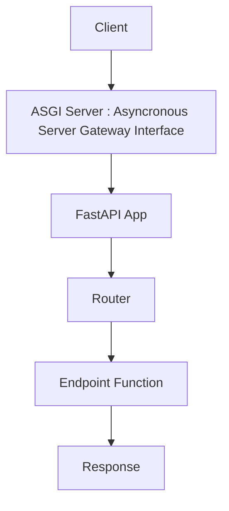
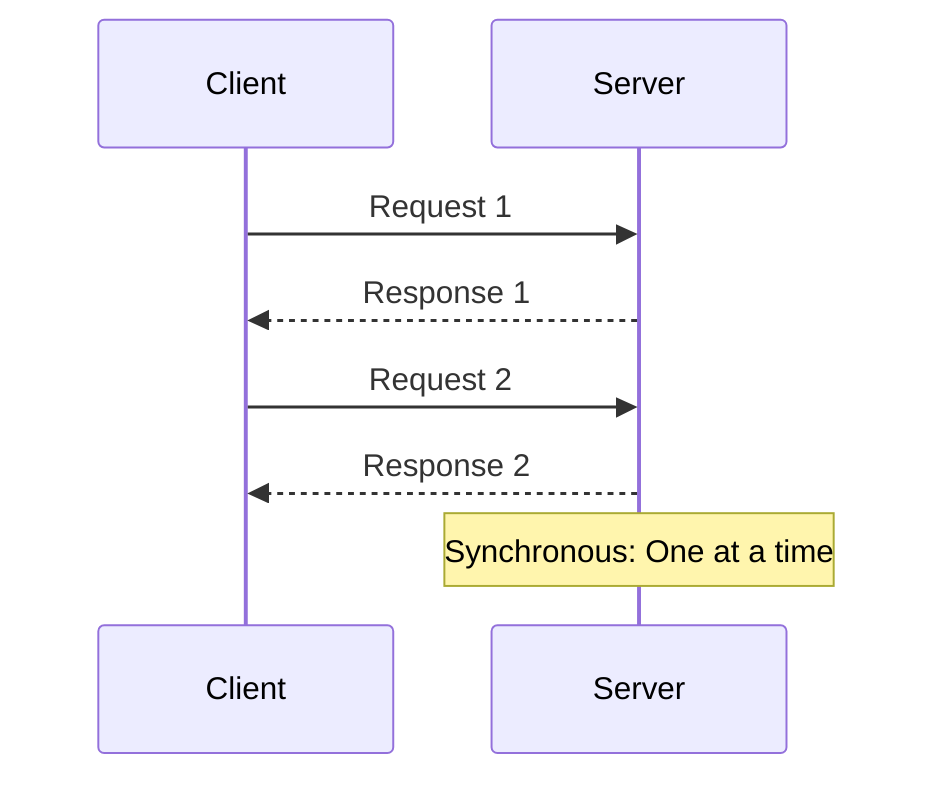
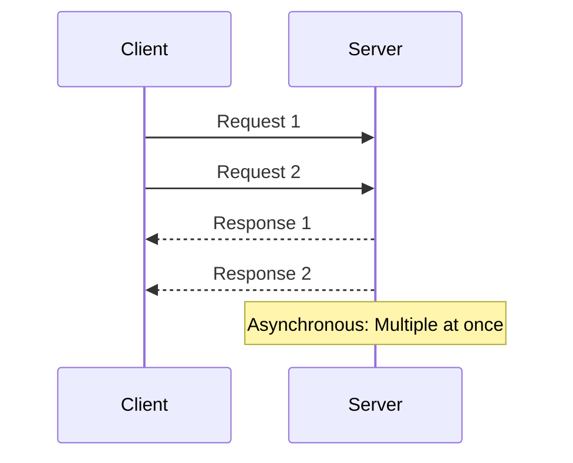
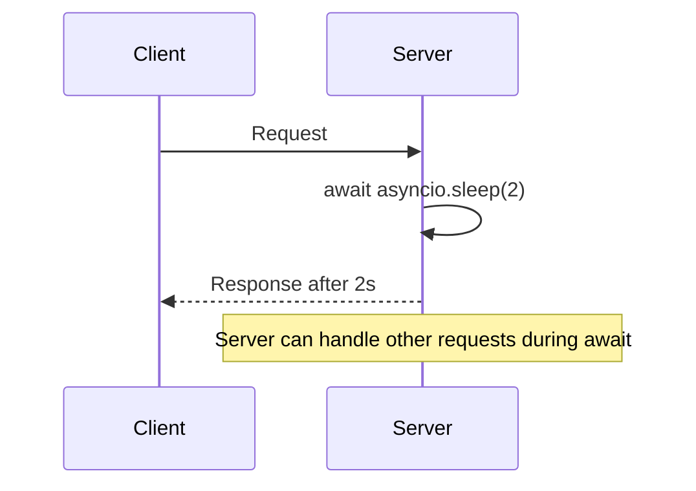

# 🚀 Introduction to FastAPI: In-Depth Theory, Examples & Diagrams

## 1. What is FastAPI?
FastAPI is a modern, high-performance web framework for building APIs with Python 3.7+ based on standard Python type hints. It is designed for speed, simplicity, and automatic documentation.

**Why use FastAPI?**
- Asynchronous support for high concurrency
- Automatic generation of OpenAPI and Swagger docs
- Data validation using Pydantic
- Type hints for better code quality

**Use Cases:**
- RESTful APIs, microservices, ML model serving, backend for web/mobile apps

---

## 2. Key Features
- **Speed:** Built on Starlette and Pydantic, FastAPI is one of the fastest Python frameworks.
- **Type Hints:** Uses Python type hints for data validation and editor support.
- **Automatic Docs:** Generates interactive API docs (Swagger UI, ReDoc).
- **Async Support:** Handles async requests natively for scalable APIs.
- **Validation:** Request/response validation with clear error messages.

---

## 3. Architecture
FastAPI uses ASGI (Asynchronous Server Gateway Interface) for async support and Starlette for web handling. Requests are validated and routed to endpoints, responses are serialized and returned.

### Key Components in FastAPI Architecture

**Starlette**
- Starlette is a lightweight ASGI framework/toolkit that provides the core web routing, middleware, and request/response handling for FastAPI. It enables features like WebSockets, background tasks, and session management. FastAPI builds on Starlette for its high-performance web layer.

**Pydantic**
- Pydantic is a data validation and settings management library using Python type annotations. In FastAPI, it powers request and response validation, serialization, and parsing. Pydantic models ensure that data sent to and from your API is correct, secure, and well-typed, with automatic error messages for invalid data.

**Uvicorn**
- Uvicorn is a lightning-fast ASGI server implementation, built on uvloop and httptools. It runs your FastAPI app, handling incoming HTTP requests asynchronously. Uvicorn is recommended for production deployments due to its speed and support for async features, making FastAPI scalable and efficient.

**InShort**
Web Framework -> Starlette
Web Server -> Uvicorn
Data Validation -> Pydantic

**Architecture Diagram:**


---

## 4. Installation
Install FastAPI and an ASGI server (e.g., Uvicorn):
```bash
pip install fastapi uvicorn
```

---

## 5. First FastAPI App
```python
from fastapi import FastAPI
app = FastAPI()

@app.get("/")
def read_root():
	return {"message": "Hello, FastAPI!"}

# Run with: uvicorn main:app --reload
```

---

## 6. Comparison: FastAPI vs Other Technologies
| Feature         | FastAPI   | Flask     | Django    |
|-----------------|-----------|-----------|-----------|
| Async Support   | Yes       | Limited   | Limited   |
| Type Hints      | Yes       | No        | No        |
| Auto Docs       | Yes       | No        | No        |
| Speed           | High      | Medium    | Medium    |
| Validation      | Yes       | Manual    | Manual    |

**Summary:** FastAPI is ideal for modern, high-performance APIs with automatic docs and async support. Flask is simple and flexible, Django is full-featured for large apps.

---


# Common Parameters of Field in FastAPI (Pydantic)

These parameters are commonly used with **FastAPI** and **Pydantic** models, especially in `Field()`, `Query()`, `Path()`, and `Body()`.

---

## Parameter Table

| **PARAMETER**  | **DESCRIPTION** |
|----------------|-----------------|
| **default**    | Default value or `...` for required |
| **title**      | Title for docs/schema |
| **description**| Description of the field |
| **example**    | Example value |
| **gt, ge**     | Greater than / Greater than or equal (numbers) |
| **lt, le**     | Less than / Less than or equal (numbers) |
| **min_length** | Minimum string length |
| **max_length** | Maximum string length |
| **regex**      | Regex pattern for string validation |

---

## Usage Examples

### 1. `default`
```python
from fastapi import Query

# Default value set to 10
limit: int = Query(default=10)
```


---

## Synchronous vs Asynchronous Programming in FastAPI

### Synchronous Programming
Synchronous code executes one operation at a time, waiting for each to finish before moving to the next. This is simple and predictable, but can block the server if a request takes a long time (e.g., waiting for a database or network response).

**Example (Synchronous):**
```python
def get_data():
	result = slow_query()
	return result
```

### Asynchronous Programming
Asynchronous code allows the server to handle other tasks while waiting for slow operations to complete. This is ideal for I/O-bound tasks and enables high concurrency, making FastAPI very efficient for APIs.

**Example (Asynchronous):**
```python
import asyncio
async def get_data():
	result = await slow_query()
	return result
```

### Mermaid Diagram: Synchronous vs Asynchronous Flow




**Summary:**
- Synchronous: Simple, but can block on slow operations.
- Asynchronous: Efficient, handles many requests at once, ideal for APIs and web servers.

---


---

## Understanding async and await in Python & FastAPI

### What are async and await?
`async` and `await` are Python keywords used to write asynchronous code. They allow you to define functions that can pause and resume, making it possible to handle many tasks concurrently (like serving multiple API requests).

**How it works:**
- `async def` defines an asynchronous function (coroutine).
- `await` pauses execution until the awaited task completes (e.g., a network call).

### Example (Async/Await in FastAPI)
```python
import asyncio
from fastapi import FastAPI

app = FastAPI()

@app.get("/wait")
async def wait():
	await asyncio.sleep(2)
	return {"message": "Waited asynchronously!"}
```

### Mermaid Diagram: Async/Await Flow


**Summary:**
- `async` and `await` make non-blocking code possible in Python and FastAPI.
- They are essential for building scalable, high-performance APIs.

---

## 📚 Further Reading & Documentation

- [FastAPI Official Documentation](https://fastapi.tiangolo.com/)
