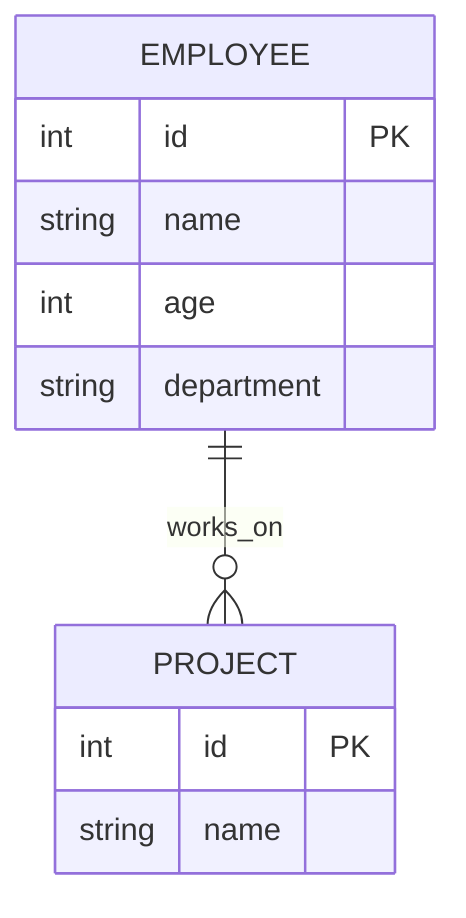

# Model Serialization in FastAPI: Deep Dive

## What is Model Serialization?

Model serialization is the process of converting complex Python objects (such as database models, classes, or custom data structures) into a format suitable for transmission or storage—most commonly JSON. In FastAPI, serialization is fundamental for API communication, as it allows Python objects to be sent as HTTP responses and received as HTTP requests.

---

## Technologies Used for Serialization in FastAPI

- **Pydantic:** The core library for data validation and serialization in FastAPI. It uses Python type hints to define schemas and automatically serializes/deserializes data.
- **JSON:** The standard format for API data exchange. FastAPI uses Python’s built-in `json` module and Pydantic’s serialization features to convert Python objects to JSON.
- **SQLAlchemy ORM:** Used for database integration. SQLAlchemy models represent database tables as Python classes. Pydantic can serialize these ORM objects using its `from_orm` or `from_attributes` feature.
- **Starlette:** The underlying ASGI framework for FastAPI, which handles request/response objects and supports JSON serialization.

---

## Theoretical Foundations

### Why Serialize?

Serialization is necessary because:

- **Interoperability:** APIs must communicate with clients written in different languages and platforms. JSON is universally supported.
- **Security:** Serialization allows you to control what data is exposed to clients, hiding sensitive fields and enforcing validation.
- **Decoupling:** Separates internal database logic from external API contracts, making your codebase more maintainable and secure.
- **Validation:** Ensures that only valid, well-structured data enters your application and database.

### How Serialization Works in FastAPI

1. **Request Validation:** Incoming JSON data is parsed and validated against Pydantic models before reaching your endpoint logic.
2. **Response Serialization:** Python objects (often ORM models) are converted to Pydantic models, which are then serialized to JSON for the HTTP response.
3. **ORM Integration:** Pydantic’s `from_orm` or `from_attributes` allows direct conversion from SQLAlchemy models to Pydantic models, bridging the database and API layers.

---

## Steps in Model Serialization (with FastAPI)

### 1. Define Pydantic Models

Pydantic models are the backbone of serialization and validation in FastAPI. They define the structure, types, and constraints of your data.

```python
from pydantic import BaseModel

class EmployeeBase(BaseModel):
    name: str
    age: int
    department: str

class EmployeeCreate(EmployeeBase):
    pass

class Employee(EmployeeBase):
    id: int
    class Config:
        from_attributes = True  # For ORM integration (Pydantic v2)
```

**Theory:**

- `BaseModel` provides automatic serialization (to JSON) and validation (type checking, constraints).
- The `Config` class with `from_attributes = True` (Pydantic v2) or `orm_mode = True` (Pydantic v1) enables Pydantic to serialize SQLAlchemy ORM models directly.
- Pydantic models can be nested, allowing for complex hierarchical data structures.

---

### 2. Use Pydantic Models in FastAPI Endpoints

```python
@app.post("/employees/", response_model=Employee)
def create_employee(employee: EmployeeCreate):
    # ... create employee in DB ...
    return employee_from_db
```

**Theory:**

- The `response_model` parameter tells FastAPI to serialize the response using the specified Pydantic model, ensuring the output matches the schema.
- Incoming requests are validated against the input model, preventing invalid data from reaching your business logic or database.
- FastAPI automatically generates OpenAPI documentation from your Pydantic models, making your API self-documenting.

---

### 3. Integrate with SQLAlchemy Models

You often need to convert SQLAlchemy ORM objects to Pydantic models for serialization.

```python
# SQLAlchemy model
class Employee(Base):
    __tablename__ = "employees"
    id = Column(Integer, primary_key=True, index=True)
    name = Column(String)
    age = Column(Integer)
    department = Column(String)

# Convert ORM object to Pydantic model
employee = db.query(Employee).first()
return Employee.model_validate(employee)  # Pydantic v2
# or Employee.from_orm(employee)  # Pydantic v1
```

**Theory:**

- ORM integration allows you to return database objects directly from your endpoints, with Pydantic handling the conversion and serialization.
- This approach keeps your API responses consistent and type-safe.

---

### 4. Serialization and Relationships

For models with relationships (e.g., an employee with multiple projects), you can nest Pydantic models to represent related data.

```python
class Project(BaseModel):
    id: int
    name: str

class EmployeeWithProjects(Employee):
    projects: list[Project] = []
```

**Theory:**

- Nested models allow you to serialize complex, hierarchical data structures (e.g., an employee and their projects) into JSON.
- This is essential for representing real-world relationships in your API responses.

#### Mermaid.js Diagram



---

## Summary Table

| Step                | Purpose                                      | Example/Code Snippet                |
|---------------------|----------------------------------------------|-------------------------------------|
| Define Pydantic Models | Structure & validate data                  | `class Employee(BaseModel): ...`    |
| Use in Endpoints    | Serialize/validate requests & responses      | `response_model=Employee`           |
| Integrate with ORM  | Convert DB models to API models              | `Employee.model_validate(obj)`      |
| Handle Relationships| Serialize nested data                        | `projects: list[Project]`           |

---

## Conclusion

Model serialization in FastAPI is essential for safe, efficient, and flexible database integration. By using Pydantic models, you ensure that your API communicates clearly and securely with clients, while keeping your database logic separate and maintainable.

**Key Technologies:**
- Pydantic for schema definition, validation, and serialization
- SQLAlchemy for ORM/database integration
- JSON for data exchange
- FastAPI/Starlette for API and ASGI support

Serialization is not just a technical detail—it is a core architectural principle that enables robust, secure, and scalable APIs.

If you need more advanced examples or want to see serialization with more complex relationships, let me know!
