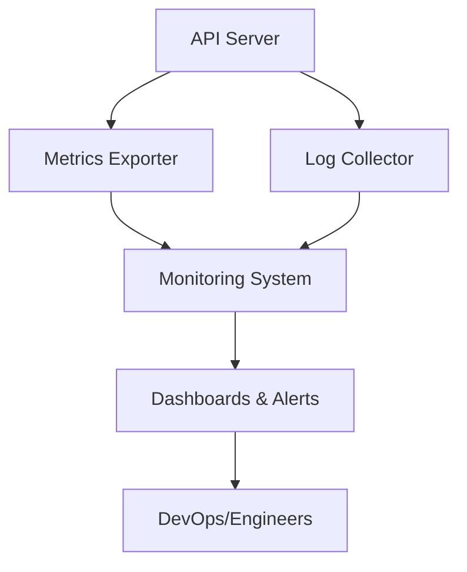
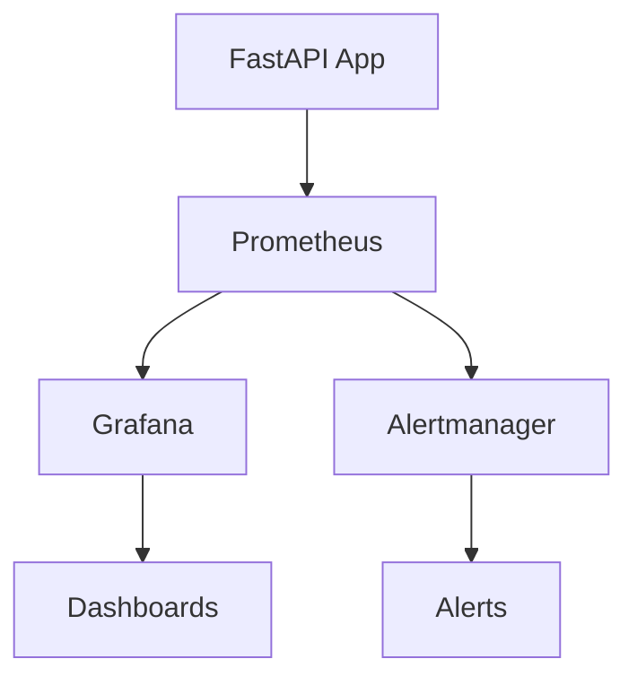

# 📡 Monitoring APIs

---

## 📊 What is API Monitoring?

**API Monitoring** is the continuous process of tracking the health, performance, and usage of your API services. It involves collecting, analyzing, and visualizing metrics and logs to ensure your APIs are available, performant, and reliable.

**Why Monitor APIs?**
- **Early Detection:** Identify issues (errors, slowdowns, outages) before users are impacted.
- **Performance Optimization:** Spot bottlenecks and optimize response times.
- **Reliability:** Ensure APIs meet uptime and SLA requirements.
- **Capacity Planning:** Understand usage trends for scaling decisions.
- **Security:** Detect unusual patterns that may indicate abuse or attacks.

---

## 🧩 Key Components of API Monitoring

- **Metrics Collection:** Gather quantitative data (latency, error rates, throughput, resource usage).
- **Logging:** Record detailed events and errors for troubleshooting.
- **Alerting:** Notify teams when metrics cross critical thresholds.
- **Visualization:** Use dashboards to observe trends and spot anomalies.
- **Tracing:** Track requests across distributed systems for root cause analysis.



---

## 🛠️ Common Tools for API Monitoring

- **Prometheus:** Open-source time-series database for metrics collection and querying.
- **Grafana:** Visualization platform for building dashboards from Prometheus and other data sources.
- **Alertmanager:** Sends alerts based on Prometheus rules.
- **ELK Stack (Elasticsearch, Logstash, Kibana):** For log aggregation, search, and visualization.
- **Jaeger/Zipkin:** Distributed tracing for microservices.

---

## 🚦 Example: Monitoring with Prometheus & FastAPI

**Prometheus** scrapes metrics from your FastAPI app’s `/metrics` endpoint, which can be exposed using the `prometheus_client` library.

**Setup Steps:**
1. **Install Prometheus client:**
   ```bash
   pip install prometheus_client
   ```
2. **Expose metrics in FastAPI:**
   ```python
   from prometheus_client import Counter, generate_latest
   from fastapi import FastAPI, Response

   app = FastAPI()
   REQUEST_COUNT = Counter('request_count', 'Total API Requests')

   @app.middleware("http")
   async def count_requests(request, call_next):
       REQUEST_COUNT.inc()
       return await call_next(request)

   @app.get("/metrics")
   def metrics():
       return Response(generate_latest(), media_type="text/plain")
   ```
3. **Configure Prometheus to scrape `/metrics` endpoint.**

---

## 📈 Visualization with Grafana

**Grafana** connects to Prometheus and visualizes metrics in real-time dashboards.

- Create panels for latency, error rates, throughput, etc.
- Set up alerts for anomalies (e.g., high error rate, slow response).



---

## 🧠 Example Metrics to Monitor

- **Request Rate:** Number of requests per second.
- **Error Rate:** Percentage of failed requests.
- **Latency:** Average and percentile response times (P50, P95, P99).
- **Resource Usage:** CPU, memory, disk, network.
- **Custom Business Metrics:** E.g., number of logins, transactions.

---

## 🏆 Best Practices for API Monitoring

- **Monitor Key Metrics:** Focus on latency, error rates, and resource usage.
- **Set Alerts:** Use thresholds for critical metrics to trigger notifications.
- **Use Dashboards:** Visualize trends and spot anomalies quickly.
- **Log Context:** Include request IDs, user info, and error details in logs.
- **Trace Requests:** Use distributed tracing for microservices to follow requests end-to-end.
- **Automate Monitoring:** Integrate monitoring setup into deployment pipelines.
- **Review Regularly:** Periodically review and update monitoring rules and dashboards.

---

## 📝 Summary Table of Monitoring Tools

| Tool           | Purpose                | Strengths                        |
|----------------|------------------------|----------------------------------|
| Prometheus     | Metrics collection     | Powerful, open-source, flexible  |
| Grafana        | Visualization          | Real-time dashboards, alerting   |
| Alertmanager   | Alerting               | Integrates with Prometheus       |
| ELK Stack      | Log aggregation        | Search, analyze, visualize logs  |
| Jaeger/Zipkin  | Distributed tracing    | Root cause analysis, microservices|

---

API monitoring is essential for maintaining the health, reliability, and performance of your FastAPI applications. By collecting and analyzing metrics and logs, you can detect issues early, optimize performance, and ensure a great user