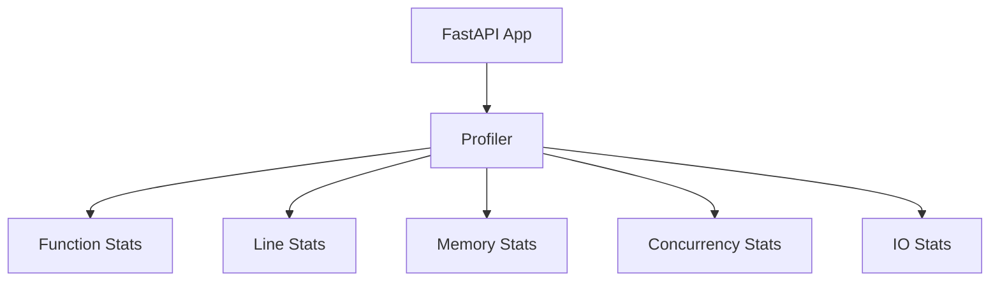
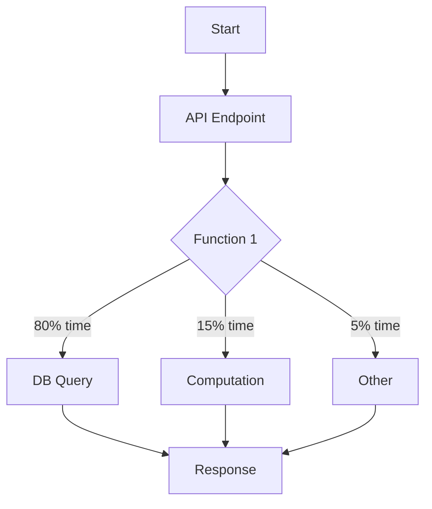
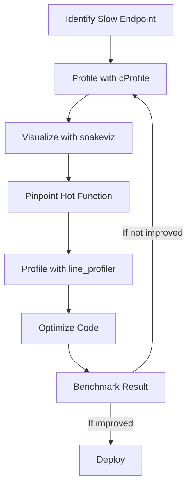

# 🧭 Profiling FastAPI Apps

---

## 📊 What is Profiling?

**Profiling** is a systematic process of collecting data about a program’s execution to understand where time and resources are spent. In the context of FastAPI (or any web application), profiling helps you answer questions like:
- Which endpoints or functions are slow?
- Where are CPU and memory resources being consumed?
- Are there any bottlenecks or inefficient code paths?
- How does the application behave under different loads?

**Why Profile?**
- **Performance Optimization:** Identify and fix slow parts of your code.
- **Resource Efficiency:** Reduce unnecessary CPU, memory, or I/O usage.
- **Scalability:** Ensure your app can handle increased traffic.
- **Cost Reduction:** Lower infrastructure costs by making code more efficient.
- **User Experience:** Faster APIs mean happier users.

**Profiling vs. Benchmarking:**  
Profiling focuses on *where* and *why* resources are used, while benchmarking measures *how much* (e.g., requests per second, latency).

---

## 🧩 Types of Profiling

- **Function-level Profiling:** Measures time spent in each function, call counts, and call relationships.
- **Line-level Profiling:** Measures time spent on each line of code, revealing micro-bottlenecks.
- **Memory Profiling:** Tracks memory allocation, usage, and leaks.
- **Concurrency Profiling:** Analyzes thread, process, or async task performance and contention.
- **I/O Profiling:** Measures time spent waiting for disk, network, or database operations.



---

## ⏱️ Simple Timing with `time`

**Theory:**  
The simplest form of profiling is measuring elapsed time for a code block. This is useful for quick checks but lacks granularity.

**Example:**
```python
import time

start = time.time()
# ... code to profile ...
end = time.time()
print("Elapsed:", end - start)
```
**Limitation:**  
Does not show *where* time is spent, only *how much*.

---

## 📊 Function Profiling with `cProfile`

**Theory:**  
`cProfile` is a deterministic profiler built into Python. It records:
- Number of calls per function
- Total time spent in each function
- Time per call
- Call relationships (who called whom)

This helps you identify the most expensive functions in your FastAPI app.

**Example:**
```python
import cProfile

def slow_function():
    for _ in range(1000000):
        pass

cProfile.run('slow_function()')
```

**Output:**  
A table showing call counts, total time, and time per call for each function.

**Interpretation:**  
Focus on functions with high total time or high call counts.

---

## 🧬 Line-by-Line Profiling with `line_profiler`

**Theory:**  
`line_profiler` provides even finer granularity by measuring the execution time of each line in a function. This is crucial for:
- Pinpointing slow lines in loops or complex logic
- Understanding the impact of specific operations

**Example:**
```python
@profile
def slow_func():
    total = 0
    for i in range(10000):
        total += i
    return total
```
Run with:  
`kernprof -l -v script.py`

**Limitation:**  
Requires code annotation and is best for targeted profiling.

---

## 🧠 Visualizing Profiling Data

**Theory:**  
Raw profiling data can be overwhelming. Visualization tools (like `snakeviz`, `py-spy`, or call graphs) help you see:
- Call hierarchies (which functions call which)
- Hot paths (where most time is spent)
- Bottlenecks and their context



**Example:**  
A call graph might show that 80% of request time is spent in a database query, suggesting DB optimization or caching.

---

## 🧵 Concurrency and Async Profiling

**Theory:**  
FastAPI is often used with async code. Profiling async functions or concurrent workloads requires tools that can track event loops, tasks, and thread/process pools.

- **Thread Profiling:** Detects thread contention and GIL issues.
- **Async Profiling:** Measures time spent awaiting I/O vs. CPU.

**Tools:**  
- `py-spy` (supports async)
- `yappi` (multi-threaded profiling)
- `async-profiler` (for advanced async analysis)

---

## 🧰 Memory Profiling

**Theory:**  
Memory leaks or excessive memory usage can degrade performance or crash your app. Memory profilers track:
- Allocation per function or line
- Growth over time
- Unreleased objects

**Example Tools:**  
- `memory_profiler`
- `tracemalloc`

---

## 🚦 Best Practices for Profiling FastAPI Apps

- **Profile in a realistic environment:** Use data and traffic patterns similar to production.
- **Profile both cold and warm runs:** Caching can mask bottlenecks.
- **Combine profiling with benchmarking:** Measure both *where* and *how much*.
- **Iterate:** Profile, optimize, and profile again.
- **Automate:** Integrate profiling into CI/CD for regression detection.
- **Focus on hot spots:** Optimize the slowest parts first for maximum impact (Pareto principle).

---

## 🛠️ Summary Table of Profiling Tools

| Tool           | Level         | Use Case                        |
|----------------|---------------|---------------------------------|
| `time`         | Block         | Quick timing checks             |
| `cProfile`     | Function      | Find slow functions             |
| `line_profiler`| Line          | Pinpoint slow lines             |
| `memory_profiler` | Memory     | Track memory usage              |
| `py-spy`, `snakeviz` | Visual  | Visualize call graphs           |
| `yappi`        | Thread/Async  | Multi-threaded/async profiling  |
| `tracemalloc`  | Memory        | Track memory allocations        |

---

## 🏁 Profiling Workflow Example



---

Profiling is essential for building high-performance FastAPI applications. By systematically measuring and analyzing your code, you can make targeted optimizations that deliver real-world speedups, better scalability, and improved