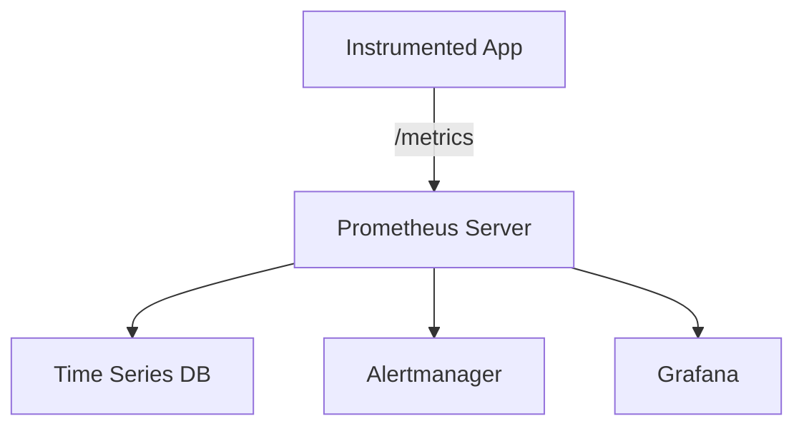
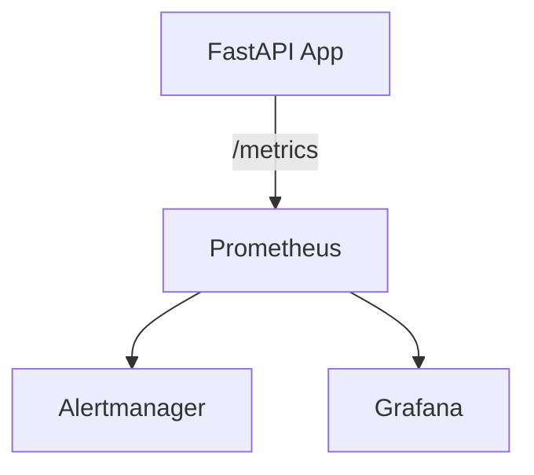
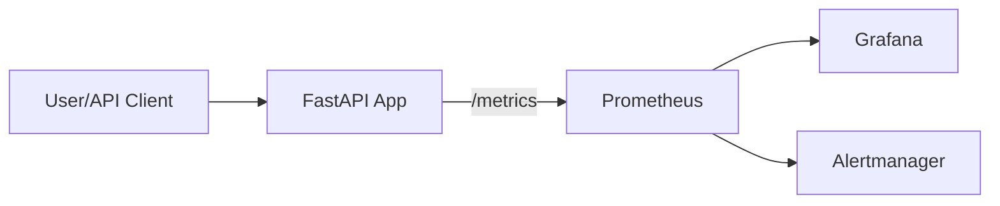

# 📈 Prometheus & FastAPI Monitoring

---

## 🧭 What is Prometheus?

**Prometheus** is an open-source systems monitoring and alerting toolkit designed for reliability and scalability. It collects and stores metrics as time series data, meaning information is stored with a timestamp, labels, and a value.

**Key Concepts:**
- **Time Series Database:** Stores metrics over time for analysis and alerting.
- **Pull Model:** Prometheus scrapes (pulls) metrics from instrumented targets via HTTP endpoints (usually `/metrics`).
- **Flexible Query Language (PromQL):** Enables powerful queries and aggregations.
- **Alerting:** Integrates with Alertmanager to send notifications based on rules.

**Why Prometheus?**
- Designed for reliability and scalability.
- Works well with dynamic cloud environments and microservices.
- Integrates with visualization tools like Grafana.



---

## 🚦 Prometheus with FastAPI

**Theory:**  
To monitor a FastAPI application, you expose a `/metrics` endpoint that Prometheus can scrape. The `prometheus_client` Python library provides tools to define and export metrics.

**Types of Metrics:**
- **Counters:** Monotonically increasing values (e.g., total requests).
- **Gauges:** Values that can go up or down (e.g., memory usage).
- **Histograms/Summaries:** Track distributions (e.g., request durations).

**Example: Exposing Metrics in FastAPI**
```python
from fastapi import FastAPI, Response
from prometheus_client import Counter, generate_latest

app = FastAPI()
REQUEST_COUNT = Counter('request_count', 'Total API Requests')

@app.middleware("http")
async def count_requests(request, call_next):
    REQUEST_COUNT.inc()
    return await call_next(request)

@app.get("/metrics")
def metrics():
    return Response(generate_latest(), media_type="text/plain")
```
- Prometheus scrapes `http://your-app/metrics` to collect data.

**Diagram:**


---

## 🐳 FastAPI with Prometheus & Docker

**Theory:**  
Running FastAPI and Prometheus in Docker containers enables easy deployment, isolation, and scalability. Prometheus can be configured to scrape metrics from the FastAPI container.

**Typical Setup:**
- **FastAPI Container:** Exposes `/metrics` endpoint.
- **Prometheus Container:** Configured to scrape FastAPI.
- **Grafana Container (optional):** For dashboards.

**Example: `docker-compose.yml`**
```yaml
version: '3'
services:
  fastapi:
    build: .
    ports:
      - "8000:8000"
  prometheus:
    image: prom/prometheus
    volumes:
      - ./prometheus.yml:/etc/prometheus/prometheus.yml
    ports:
      - "9090:9090"
  grafana:
    image: grafana/grafana
    ports:
      - "3000:3000"
```

**Example: `prometheus.yml`**
```yaml
scrape_configs:
  - job_name: 'fastapi'
    static_configs:
      - targets: ['fastapi:8000']
```

**Workflow Diagram:**


**How it works:**
1. FastAPI exposes `/metrics`.
2. Prometheus (in Docker) scrapes metrics from FastAPI.
3. Grafana visualizes metrics from Prometheus.
4. Alertmanager sends notifications if rules are triggered.

---

## 🏆 Best Practices

- **Instrument Key Metrics:** Track request count, latency, error rates, and resource usage.
- **Use Labels:** Add labels (e.g., endpoint, status code) for granular analysis.
- **Secure `/metrics`:** Protect metrics endpoint if exposing sensitive data.
- **Automate with Docker Compose:** Simplifies setup and scaling.
- **Visualize with Grafana:** Build dashboards for real-time monitoring and alerting.

---

Prometheus, combined with FastAPI and Docker, provides a robust, scalable, and flexible

## 📚 Documentation

- [Prometheus Documentation](https://prometheus.io/docs)