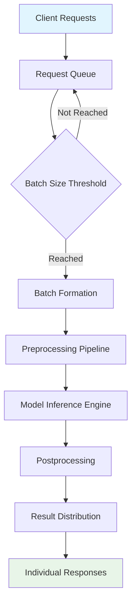

# Handling Batch Predictions: Theoretical Foundations and Implementation

## Introduction to Batch Predictions

Batch predictions represent a fundamental paradigm in machine learning inference, where multiple data points are processed simultaneously rather than individually. This approach embodies the principles of computational efficiency and resource optimization, contrasting with the sequential processing inherent in single predictions.

### Theoretical Context

From a computational complexity perspective, batch processing transforms the problem from O(n) individual operations to O(n/b) batch operations, where b represents the batch size. This reduction in algorithmic complexity stems from vectorized computations and optimized memory access patterns.

The theoretical underpinnings of batch predictions can be traced to several computer science principles:

1. **Vectorization Theory**: Modern processors excel at parallel operations on contiguous data structures, making batch processing inherently more efficient than scalar operations.

2. **Memory Hierarchy Optimization**: Batch processing aligns with CPU cache architectures, reducing cache misses and improving data locality.

3. **Amortized Analysis**: The fixed overhead of model loading and preprocessing is distributed across multiple predictions, reducing the per-prediction cost.

## Core Theoretical Concepts

### Batch Size Optimization Theory

The optimal batch size represents a trade-off between several competing factors:

- **Memory Constraints**: Larger batches require more RAM but reduce overhead
- **Latency Requirements**: Smaller batches provide faster response times
- **Throughput Maximization**: Larger batches maximize computational efficiency
- **Cache Utilization**: Batch size affects CPU cache hit rates

### Parallel Processing Theory

Batch predictions leverage parallel processing at multiple levels:

1. **Instruction-Level Parallelism (ILP)**: Modern CPUs process multiple instructions simultaneously
2. **Data-Level Parallelism (DLP)**: Vectorized operations on arrays
3. **Task-Level Parallelism**: Multiple predictions processed concurrently

### Memory Management Theory

Efficient batch processing requires sophisticated memory management:

- **Contiguous Memory Allocation**: Reduces memory fragmentation
- **Memory Pooling**: Reuses allocated memory across batches
- **Garbage Collection Optimization**: Minimizes GC pauses during processing

## Implementation Architecture

### Theoretical Architecture Patterns

#### Synchronous Batch Processing

In synchronous batch processing, all predictions within a batch are computed before returning results. This approach maximizes throughput but may introduce latency for individual predictions.

#### Asynchronous Batch Processing

Asynchronous processing allows for non-blocking operations, where predictions are queued and processed in the background, enabling higher concurrency.

#### Streaming Batch Processing

Streaming approaches process data in continuous flows, maintaining state across multiple batches and enabling real-time processing capabilities.

### Data Flow Theory

The theoretical data flow in batch predictions follows a pipeline architecture:

1. **Input Aggregation**: Multiple requests are collected into a single batch
2. **Preprocessing Pipeline**: Data normalization and feature engineering
3. **Model Inference**: Parallel computation across the batch
4. **Postprocessing**: Result formatting and validation
5. **Output Distribution**: Results returned to individual requesters



## FastAPI Integration Theory

### Request-Response Cycle Theory

In FastAPI, batch predictions introduce complexity to the traditional request-response cycle:

- **Request Batching**: Multiple HTTP requests are aggregated
- **Response Correlation**: Results must be matched to original requests
- **Error Handling**: Partial failures within batches require sophisticated error propagation
- **Timeout Management**: Batch processing times affect individual request timeouts

### Dependency Injection Theory

FastAPI's dependency injection system provides theoretical advantages for batch processing:

- **Resource Sharing**: Models and preprocessing components can be shared across batch items
- **Caching Strategies**: Intermediate results can be cached between predictions
- **Connection Pooling**: Database connections can be efficiently managed

### Asynchronous Programming Theory

FastAPI's async capabilities enable sophisticated batch processing patterns:

- **Concurrent Processing**: Multiple batches can be processed simultaneously
- **Non-blocking I/O**: Database operations and external API calls don't block processing
- **Resource Efficiency**: Threads are utilized more efficiently through async patterns

## Database Integration Theory

### Transaction Theory in Batch Processing

Batch predictions introduce complex transaction semantics:

- **Atomicity**: All predictions in a batch should succeed or fail together
- **Consistency**: Database state remains consistent across batch operations
- **Isolation**: Concurrent batches don't interfere with each other
- **Durability**: Prediction results are reliably stored

### Query Optimization Theory

Efficient database integration requires sophisticated query patterns:

- **Bulk Inserts**: Multiple prediction results stored efficiently
- **Batch Selects**: Retrieving multiple input records simultaneously
- **Index Utilization**: Optimized database indexes for prediction queries
- **Connection Pooling**: Managing database connections across batch operations

### Caching Theory

Theoretical caching strategies for batch predictions:

- **Input Caching**: Frequently requested data cached to reduce database load
- **Result Caching**: Prediction results cached for identical inputs
- **Model Caching**: Trained models cached in memory for fast access
- **Intermediate Caching**: Preprocessing results cached between batch items

## Performance Optimization Theory

### Computational Complexity Analysis

Batch processing fundamentally alters the computational complexity:

- **Time Complexity**: O(n/b + c) where c is constant overhead
- **Space Complexity**: O(b) for batch storage vs O(1) for single predictions
- **I/O Complexity**: Reduced I/O operations through batching

### Scalability Theory

Theoretical scalability considerations:

- **Horizontal Scaling**: Multiple servers processing different batches
- **Vertical Scaling**: Larger servers handling bigger batches
- **Load Balancing**: Distributing batches across available resources
- **Auto-scaling**: Dynamic resource allocation based on batch size

### Resource Utilization Theory

Optimal resource utilization requires balancing:

- **CPU Utilization**: Maximizing vectorized operations
- **Memory Utilization**: Efficient memory allocation and garbage collection
- **I/O Utilization**: Minimizing disk and network access
- **Network Utilization**: Efficient data transfer patterns

## Error Handling and Resilience Theory

### Failure Mode Analysis

Theoretical analysis of potential failure modes:

- **Partial Batch Failures**: Some predictions succeed while others fail
- **Resource Exhaustion**: Memory or CPU limits exceeded
- **Model Loading Failures**: Issues with model deserialization
- **Database Connection Failures**: Connectivity problems during processing

### Recovery Theory

Sophisticated recovery mechanisms:

- **Retry Logic**: Automatic retry of failed predictions
- **Circuit Breaker Pattern**: Preventing cascade failures
- **Graceful Degradation**: Reduced functionality during high load
- **Rollback Mechanisms**: Undoing partial batch operations

### Monitoring Theory

Theoretical monitoring approaches:

- **Performance Metrics**: Latency, throughput, and resource utilization
- **Error Rates**: Tracking prediction failure rates
- **Batch Size Distribution**: Analyzing optimal batch sizes
- **Resource Usage Patterns**: Identifying bottlenecks and optimization opportunities

## Security Considerations Theory

### Input Validation Theory

Theoretical security measures for batch inputs:

- **Schema Validation**: Ensuring input data conforms to expected formats
- **Sanitization**: Removing potentially malicious content
- **Rate Limiting**: Preventing abuse through excessive batch sizes
- **Authentication**: Verifying request authenticity

### Data Privacy Theory

Protecting sensitive data in batch processing:

- **Encryption**: Securing data in transit and at rest
- **Access Control**: Limiting who can submit batch requests
- **Audit Logging**: Tracking all batch operations for compliance
- **Data Minimization**: Only processing necessary data

## Implementation Steps

### Step 1: Define Batch Schema

Theoretical foundation: Schema design must balance flexibility with type safety.

```python
from pydantic import BaseModel
from typing import List

class BatchInput(BaseModel):
    items: List[dict]  # List of prediction inputs
    batch_id: str     # Unique identifier for tracking
```

### Step 2: Implement Batch Processing Logic

Theoretical approach: Processing logic should be stateless and idempotent.

```python
async def process_batch(batch_data: BatchInput):
    # Theoretical processing pipeline
    preprocessed = preprocess_batch(batch_data.items)
    predictions = model.predict(preprocessed)
    results = postprocess_predictions(predictions)
    return results
```

### Step 3: Database Integration

Theoretical pattern: Use transactions for atomic batch operations.

```python
async def store_batch_results(db, batch_id, results):
    async with db.transaction():
        for result in results:
            await db.execute(
                "INSERT INTO predictions (batch_id, result) VALUES (?, ?)",
                batch_id, result
            )
```

### Step 4: Error Handling

Theoretical approach: Implement comprehensive error handling with recovery.

```python
async def handle_batch_errors(batch_data, errors):
    # Theoretical error classification
    recoverable = []
    non_recoverable = []
    
    for error in errors:
        if is_recoverable(error):
            recoverable.append(error)
        else:
            non_recoverable.append(error)
    
    # Implement recovery strategies
    await retry_recoverable(recoverable)
    await log_non_recoverable(non_recoverable)
```

### Step 5: Performance Monitoring

Theoretical monitoring framework:

```python
class BatchMetrics:
    def __init__(self):
        self.batch_size = 0
        self.processing_time = 0
        self.memory_usage = 0
        self.error_rate = 0
    
    def record_batch(self, batch_data, results, errors):
        # Theoretical metric calculation
        self.batch_size = len(batch_data.items)
        self.error_rate = len(errors) / self.batch_size
        # Additional metric computations...
```

## Advanced Theoretical Concepts

### Distributed Batch Processing

Theoretical foundations of distributed systems:

- **Consistency Models**: Ensuring batch results are consistent across nodes
- **Partitioning Strategies**: Dividing batches across multiple workers
- **Coordination Protocols**: Managing distributed batch processing
- **Fault Tolerance**: Handling node failures during batch processing

### Machine Learning Pipeline Theory

Integration with ML pipelines:

- **Feature Engineering**: Batch processing of feature transformations
- **Model Ensembling**: Combining predictions from multiple models
- **A/B Testing**: Running different models on the same batch
- **Model Versioning**: Managing multiple model versions in production

### Real-time Batch Processing

Theoretical approaches to real-time systems:

- **Sliding Windows**: Processing data in moving time windows
- **Event-Driven Architecture**: Triggering batches based on events
- **Stream Processing**: Continuous batch processing of streaming data
- **Lambda Architecture**: Combining batch and real-time processing

## Conclusion

Batch predictions represent a sophisticated optimization strategy that requires deep understanding of computer science principles, system architecture, and performance optimization. The theoretical foundations emphasize the importance of balancing efficiency with reliability, scalability with simplicity, and performance with maintainability.

Successful implementation requires careful consideration of the trade-offs between different architectural approaches, thorough understanding of the underlying computational models, and rigorous attention to error handling and monitoring. The theoretical framework provided here serves as a foundation for building robust, efficient batch prediction systems in
