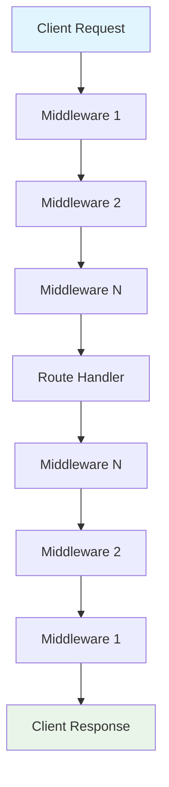
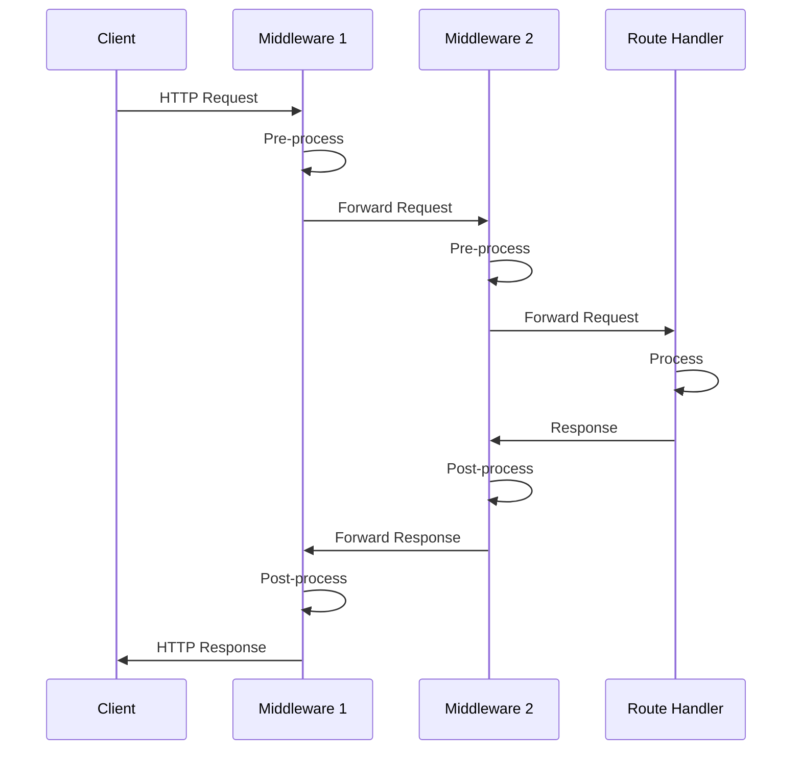
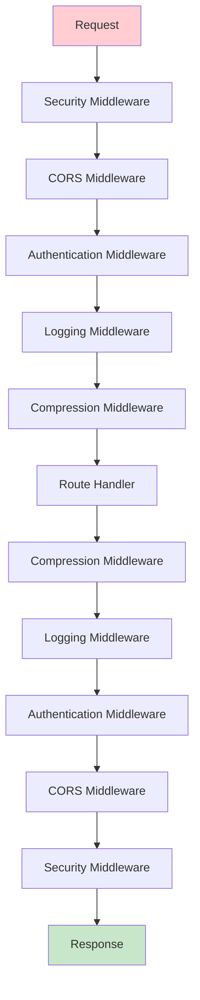

# FastAPI Middlewares: Deep Theoretical and Practical Analysis

## Introduction

Middleware is a foundational concept in web application architecture, acting as an intermediary layer that processes requests and responses globally. In FastAPI, middleware enables developers to implement cross-cutting concerns—such as logging, authentication, error handling, and performance monitoring—without polluting endpoint logic.

---

## Theoretical Foundations

### Middleware as a Design Pattern

**Middleware** embodies the **Chain of Responsibility** design pattern. Each middleware component receives a request, can process or modify it, and then passes it to the next component in the chain. This pattern promotes:

- **Separation of Concerns:** Each middleware addresses a specific aspect (e.g., security, logging).
- **Composability:** Middlewares can be stacked and reused.
- **Extensibility:** New behaviors can be added without changing endpoint code.

### Mathematical Model

Let each middleware be a function \( m_i \) and the route handler be \( h \). The request \( r \) is processed as:

\[
response = m_n(...m_2(m_1(h(r)))...)
\]

This is a classic example of **function composition** in mathematics.

### Pipeline Architecture

Middlewares form a pipeline, processing requests before they reach the route handler and responses before they are sent to the client.



---

## Middleware Lifecycle in FastAPI

The middleware lifecycle in FastAPI follows a precise execution model that can be understood through **control flow theory** and **event-driven programming**:

1. **Request Interception:** Middleware receives the incoming request object, implementing the **Observer Pattern**.
2. **Pre-processing:** Middleware can validate, log, or modify the request using **filtering algorithms**.
3. **Passing Control:** Middleware passes the request to the next layer via **continuation-passing style**.
4. **Route Handler Execution:** The endpoint processes the request in the **application layer**.
5. **Post-processing:** Middleware can modify or log the response using **transformation functions**.
6. **Response Dispatch:** The final response is sent to the client through **event emission**.

### Execution Flow Diagram



---

## Types of Middleware: Deep Theoretical Analysis

### 1. Request Middleware

**Theoretical Foundation:** Request middleware operates at the **ingress boundary** of the application, implementing **precondition checking** and **input validation** based on **formal verification** principles.

**Computer Science Principles:**
- **Guard Conditions:** Implement boolean predicates that must be satisfied before proceeding
- **Input Sanitization:** Apply **normalization algorithms** to ensure data consistency
- **Authentication Protocols:** Implement **cryptographic verification** of identity claims

**Example: JWT Authentication Middleware**
```python
import jwt
from starlette.middleware.base import BaseHTTPMiddleware
from fastapi import HTTPException
from starlette.responses import JSONResponse

class JWTAuthMiddleware(BaseHTTPMiddleware):
    def __init__(self, app, secret_key: str, algorithm: str = "HS256"):
        super().__init__(app)
        self.secret_key = secret_key
        self.algorithm = algorithm
    
    async def dispatch(self, request, call_next):
        # Skip authentication for public endpoints
        if request.url.path in ["/docs", "/redoc", "/openapi.json"]:
            return await call_next(request)
        
        # Extract token from Authorization header
        auth_header = request.headers.get("Authorization")
        if not auth_header or not auth_header.startswith("Bearer "):
            return JSONResponse(
                status_code=401,
                content={"error": "Missing or invalid authorization header"}
            )
        
        token = auth_header.split(" ")[1]
        
        try:
            # Verify and decode JWT token
            payload = jwt.decode(token, self.secret_key, algorithms=[self.algorithm])
            # Add user info to request state for downstream use
            request.state.user = payload
        except jwt.ExpiredSignatureError:
            return JSONResponse(status_code=401, content={"error": "Token expired"})
        except jwt.InvalidTokenError:
            return JSONResponse(status_code=401, content={"error": "Invalid token"})
        
        response = await call_next(request)
        return response
```

**Theoretical Analysis:**
- **Cryptographic Security:** Uses HMAC-SHA256 for token verification
- **State Management:** Maintains user context across request lifecycle
- **Error Handling:** Implements graceful degradation for authentication failures

### 2. Response Middleware

**Theoretical Foundation:** Response middleware implements the **Decorator Pattern** and **Aspect-Oriented Programming (AOP)** principles, applying cross-cutting concerns to response objects.

**Computer Science Principles:**
- **Content Transformation:** Apply **encoding algorithms** and **compression theory**
- **Header Injection:** Implement **metadata enrichment** for protocol compliance
- **Cache Control:** Apply **caching strategies** based on **temporal locality theory**

**Example: Response Enhancement Middleware**
```python
import time
import json
from starlette.middleware.base import BaseHTTPMiddleware
from starlette.responses import Response

class ResponseEnhancementMiddleware(BaseHTTPMiddleware):
    async def dispatch(self, request, call_next):
        start_time = time.time()
        
        # Process request
        response = await call_next(request)
        
        # Calculate processing time
        process_time = time.time() - start_time
        
        # Add custom headers
        response.headers["X-Process-Time"] = str(process_time)
        response.headers["X-Content-Type-Options"] = "nosniff"
        response.headers["X-Frame-Options"] = "DENY"
        response.headers["X-XSS-Protection"] = "1; mode=block"
        
        # Add HSTS header for HTTPS
        if request.url.scheme == "https":
            response.headers["Strict-Transport-Security"] = "max-age=31536000; includeSubDomains"
        
        # Add server info (optional, for debugging)
        response.headers["X-Server-Info"] = "FastAPI/Starlette"
        
        return response
```

**Theoretical Analysis:**
- **Performance Monitoring:** Implements **timing analysis** for request processing
- **Security Headers:** Applies **defense-in-depth** security principles
- **Protocol Compliance:** Ensures adherence to HTTP security standards

### 3. Exception Middleware

**Theoretical Foundation:** Exception middleware implements **fault tolerance** and **error recovery** patterns, providing **graceful degradation** in distributed systems.

**Computer Science Principles:**
- **Exception Propagation:** Implements **control flow redirection** for error states
- **Error Classification:** Applies **taxonomic categorization** of error types
- **Logging Strategies:** Implements **structured logging** for observability

**Example: Comprehensive Exception Middleware**
```python
import logging
import traceback
from starlette.middleware.base import BaseHTTPMiddleware
from starlette.responses import JSONResponse
from fastapi import HTTPException

# Configure structured logging
logging.basicConfig(level=logging.INFO)
logger = logging.getLogger(__name__)

class ExceptionHandlingMiddleware(BaseHTTPMiddleware):
    async def dispatch(self, request, call_next):
        try:
            response = await call_next(request)
            return response
        
        except HTTPException as http_exc:
            # Handle FastAPI HTTP exceptions
            logger.warning(f"HTTP Exception: {http_exc.status_code} - {http_exc.detail}")
            return JSONResponse(
                status_code=http_exc.status_code,
                content={
                    "error": "Client Error",
                    "detail": http_exc.detail,
                    "status_code": http_exc.status_code
                }
            )
        
        except ValueError as val_err:
            # Handle value errors (input validation failures)
            logger.error(f"Validation Error: {str(val_err)}")
            return JSONResponse(
                status_code=400,
                content={
                    "error": "Validation Error",
                    "detail": str(val_err),
                    "status_code": 400
                }
            )
        
        except ConnectionError as conn_err:
            # Handle database/external service connection errors
            logger.error(f"Connection Error: {str(conn_err)}")
            return JSONResponse(
                status_code=503,
                content={
                    "error": "Service Unavailable",
                    "detail": "External service connection failed",
                    "status_code": 503
                }
            )
        
        except Exception as exc:
            # Handle all other exceptions
            logger.critical(f"Unhandled Exception: {str(exc)}\nTraceback: {traceback.format_exc()}")
            return JSONResponse(
                status_code=500,
                content={
                    "error": "Internal Server Error",
                    "detail": "An unexpected error occurred",
                    "status_code": 500
                }
            )
```

**Theoretical Analysis:**
- **Error Taxonomy:** Classifies errors into recoverable and non-recoverable categories
- **Observability:** Implements comprehensive logging for system monitoring
- **Graceful Degradation:** Provides meaningful responses even during failures

---

## Built-in Middlewares: Comprehensive Analysis

### 1. CORSMiddleware: Cross-Origin Resource Sharing

**Theoretical Foundation:** CORS implements the **Same-Origin Policy** relaxation mechanism, enabling controlled cross-domain resource access while maintaining security boundaries.

**Computer Science Principles:**
- **Origin Validation:** Implements **whitelist-based access control**
- **Preflight Handling:** Supports **OPTIONS method protocol** for complex requests
- **Credential Management:** Implements **cookie-based authentication** across origins

```python
from fastapi import FastAPI
from fastapi.middleware.cors import CORSMiddleware

app = FastAPI()

app.add_middleware(
    CORSMiddleware,
    allow_origins=["http://localhost:3000", "https://yourdomain.com"],
    allow_credentials=True,  # Allow cookies and authorization headers
    allow_methods=["GET", "POST", "PUT", "DELETE"],
    allow_headers=["*"],
    expose_headers=["X-Custom-Header"],  # Headers accessible to client
    max_age=600,  # Preflight cache duration in seconds
)
```

**Security Implications:**
- **Origin Spoofing Protection:** Validates request origin headers
- **Credential Isolation:** Controls cross-origin credential sharing
- **Attack Surface Reduction:** Limits allowed methods and headers

### 2. GZipMiddleware: Response Compression

**Theoretical Foundation:** Implements **lossless compression algorithms** based on **information theory** and **Huffman coding** principles.

**Computer Science Principles:**
- **Entropy Reduction:** Applies **statistical compression** to reduce data redundancy
- **Bandwidth Optimization:** Implements **network efficiency algorithms**
- **CPU-Memory Trade-off:** Balances processing overhead against bandwidth savings

```python
from fastapi.middleware.gzip import GZipMiddleware

app.add_middleware(
    GZipMiddleware,
    minimum_size=1000,  # Only compress responses larger than 1KB
    compresslevel=6     # Compression level (1-9, higher = more compression)
)
```

**Performance Analysis:**
- **Compression Ratio:** Typically achieves 60-80% size reduction for text content
- **CPU Overhead:** Adds ~2-5ms processing time per request
- **Network Savings:** Reduces bandwidth usage proportionally to compression ratio

### 3. TrustedHostMiddleware: Host Header Validation

**Theoretical Foundation:** Implements **Host Header Attack** prevention through **domain validation** and **DNS security** principles.

```python
from starlette.middleware.trustedhost import TrustedHostMiddleware

app.add_middleware(
    TrustedHostMiddleware,
    allowed_hosts=["example.com", "*.example.com", "localhost:8000"]
)
```

**Security Analysis:**
- **Host Spoofing Prevention:** Validates Host header against whitelist
- **DNS Rebinding Protection:** Prevents malicious domain redirection
- **Cache Poisoning Mitigation:** Reduces HTTP cache pollution attacks

### 4. SessionMiddleware: Stateful Session Management

**Theoretical Foundation:** Implements **session state management** using **cryptographic signing** and **cookie-based storage**.

```python
from starlette.middleware.sessions import SessionMiddleware

app.add_middleware(
    SessionMiddleware,
    secret_key="your-256-bit-secret-key-here",
    session_cookie="session_id",
    max_age=3600,  # Session expires after 1 hour
    same_site="strict",  # CSRF protection
    https_only=True  # Secure flag for HTTPS
)
```

**Cryptographic Security:**
- **HMAC Signing:** Uses SHA-256 for session integrity
- **Anti-Tampering:** Detects client-side session modification
- **Secure Transport:** Enforces HTTPS-only transmission

---

## Advanced Middleware Concepts

### Middleware Composition and Ordering

**Theoretical Foundation:** Middleware composition follows **function composition** rules and **dependency ordering** principles.



**Ordering Principles:**
1. **Security First:** Authentication and authorization should execute early
2. **Protocol Handling:** CORS and host validation before business logic
3. **Transformation Last:** Compression and formatting should execute last
4. **Logging Throughout:** Request/response logging spans the entire pipeline

### Short-Circuiting and Control Flow

**Theoretical Analysis:** Short-circuiting implements **early termination** algorithms, optimizing performance through **lazy evaluation**.

```python
class ConditionalMiddleware(BaseHTTPMiddleware):
    async def dispatch(self, request, call_next):
        # Short-circuit for health checks
        if request.url.path == "/health":
            return JSONResponse({"status": "healthy"})
        
        # Short-circuit for rate limiting
        if await self.is_rate_limited(request):
            return JSONResponse(
                status_code=429,
                content={"error": "Rate limit exceeded"}
            )
        
        # Continue with normal processing
        return await call_next(request)
```

### Asynchronous Middleware Patterns

**Theoretical Foundation:** Async middleware leverages **event-driven architecture** and **cooperative multitasking** for scalable request processing.

```python
import asyncio
from starlette.middleware.base import BaseHTTPMiddleware

class AsyncLoggingMiddleware(BaseHTTPMiddleware):
    def __init__(self, app):
        super().__init__(app)
        self.log_queue = asyncio.Queue()
        self.start_log_processor()
    
    def start_log_processor(self):
        asyncio.create_task(self.process_logs())
    
    async def process_logs(self):
        while True:
            log_entry = await self.log_queue.get()
            await self.write_to_database(log_entry)
            self.log_queue.task_done()
    
    async def dispatch(self, request, call_next):
        start_time = time.time()
        response = await call_next(request)
        
        # Non-blocking log entry
        log_entry = {
            "timestamp": start_time,
            "method": request.method,
            "url": str(request.url),
            "status_code": response.status_code,
            "duration": time.time() - start_time
        }
        
        await self.log_queue.put(log_entry)
        return response
```

---

## Performance Analysis and Optimization

### Middleware Performance Metrics

**Theoretical Framework:** Performance analysis uses **queueing theory** and **response time analysis**.

```python
class PerformanceMonitoringMiddleware(BaseHTTPMiddleware):
    def __init__(self, app):
        super().__init__(app)
        self.metrics = {
            "request_count": 0,
            "total_time": 0,
            "max_time": 0,
            "min_time": float('inf')
        }
    
    async def dispatch(self, request, call_next):
        start_time = time.time()
        response = await call_next(request)
        duration = time.time() - start_time
        
        # Update metrics
        self.metrics["request_count"] += 1
        self.metrics["total_time"] += duration
        self.metrics["max_time"] = max(self.metrics["max_time"], duration)
        self.metrics["min_time"] = min(self.metrics["min_time"], duration)
        
        # Add performance headers
        response.headers["X-Response-Time"] = f"{duration:.4f}s"
        response.headers["X-Request-Count"] = str(self.metrics["request_count"])
        
        return response
```

### Memory Management in Middleware

**Theoretical Principles:** Efficient middleware design follows **memory locality** and **garbage collection** optimization principles.

```python
class MemoryEfficientMiddleware(BaseHTTPMiddleware):
    def __init__(self, app, max_cache_size: int = 1000):
        super().__init__(app)
        self.cache = {}
        self.max_cache_size = max_cache_size
        self.cache_hits = 0
        self.cache_misses = 0
    
    async def dispatch(self, request, call_next):
        cache_key = f"{request.method}:{request.url.path}"
        
        # Check cache for GET requests only
        if request.method == "GET" and cache_key in self.cache:
            self.cache_hits += 1
            cached_response = self.cache[cache_key]
            return Response(
                content=cached_response["content"],
                status_code=cached_response["status_code"],
                headers={**cached_response["headers"], "X-Cache": "HIT"}
            )
        
        self.cache_misses += 1
        response = await call_next(request)
        
        # Cache successful GET responses
        if request.method == "GET" and response.status_code == 200:
            if len(self.cache) >= self.max_cache_size:
                # LRU eviction - remove oldest entry
                oldest_key = next(iter(self.cache))
                del self.cache[oldest_key]
            
            self.cache[cache_key] = {
                "content": response.body,
                "status_code": response.status_code,
                "headers": dict(response.headers)
            }
        
        response.headers["X-Cache"] = "MISS"
        return response
```

---

## Security Considerations in Middleware

### Defense in Depth Strategy

**Theoretical Framework:** Implements **layered security** architecture with multiple independent security controls.

```python
class SecurityMiddleware(BaseHTTPMiddleware):
    def __init__(self, app):
        super().__init__(app)
        self.blocked_ips = set()
        self.rate_limiter = {}
    
    async def dispatch(self, request, call_next):
        client_ip = request.client.host
        
        # IP blocking check
        if client_ip in self.blocked_ips:
            return JSONResponse(status_code=403, content={"error": "IP blocked"})
        
        # Rate limiting
        current_time = time.time()
        if client_ip not in self.rate_limiter:
            self.rate_limiter[client_ip] = []
        
        # Clean old requests (sliding window)
        self.rate_limiter[client_ip] = [
            req_time for req_time in self.rate_limiter[client_ip]
            if current_time - req_time < 60  # 1-minute window
        ]
        
        if len(self.rate_limiter[client_ip]) >= 100:  # 100 requests per minute
            return JSONResponse(status_code=429, content={"error": "Rate limit exceeded"})
        
        self.rate_limiter[client_ip].append(current_time)
        
        # Input validation
        if await self.contains_malicious_patterns(request):
            self.blocked_ips.add(client_ip)
            return JSONResponse(status_code=400, content={"error": "Malicious request detected"})
        
        response = await call_next(request)
        
        # Security headers
        response.headers.update({
            "X-Content-Type-Options": "nosniff",
            "X-Frame-Options": "DENY",
            "X-XSS-Protection": "1; mode=block",
            "Referrer-Policy": "strict-origin-when-cross-origin",
            "Content-Security-Policy": "default-src 'self'"
        })
        
        return response
    
    async def contains_malicious_patterns(self, request):
        # Simple XSS and SQL injection detection
        malicious_patterns = [
            '<script', 'javascript:', 'SELECT * FROM', 'DROP TABLE',
            'UNION SELECT', '<iframe', 'eval(', 'document.cookie'
        ]
        
        request_data = str(request.url) + str(request.headers)
        if hasattr(request, 'body'):
            body = await request.body()
            request_data += body.decode('utf-8', errors='ignore')
        
        return any(pattern.lower() in request_data.lower() for pattern in malicious_patterns)
```

---

## Testing and Debugging Middleware

### Unit Testing Middleware

```python
import pytest
from starlette.testclient import TestClient
from fastapi import FastAPI

def test_custom_middleware():
    app = FastAPI()
    app.add_middleware(CustomMiddleware)
    
    @app.get("/test")
    async def test_endpoint():
        return {"message": "test"}
    
    client = TestClient(app)
    response = client.get("/test")
    
    assert response.status_code == 200
    assert "X-Custom-Header" in response.headers
```

### Performance Testing

```python
import time
import statistics
from concurrent.futures import ThreadPoolExecutor
from starlette.testclient import TestClient

def performance_test_middleware():
    app = FastAPI()
    app.add_middleware(PerformanceMonitoringMiddleware)
    
    @app.get("/benchmark")
    async def benchmark_endpoint():
        return {"data": "benchmark"}
    
    client = TestClient(app)
    
    # Measure response times
    response_times = []
    
    def make_request():
        start = time.time()
        response = client.get("/benchmark")
        end = time.time()
        response_times.append(end - start)
        return response.status_code
    
    # Concurrent requests
    with ThreadPoolExecutor(max_workers=10) as executor:
        results = list(executor.map(make_request, range(100)))
    
    # Statistical analysis
    avg_time = statistics.mean(response_times)
    median_time = statistics.median(response_times)
    p95_time = sorted(response_times)[int(len(response_times) * 0.95)]
    
    print(f"Average response time: {avg_time:.4f}s")
    print(f"Median response time: {median_time:.4f}s")
    print(f"95th percentile: {p95_time:.4f}s")
```

---

## Summary

FastAPI middleware provides a powerful mechanism for implementing cross-cutting concerns through a well-defined pipeline architecture. The theoretical foundations span multiple computer science disciplines:

- **Software Engineering:** Chain of Responsibility pattern, separation of concerns
- **Systems Programming:** Asynchronous processing, memory management
- **Security:** Defense in depth, cryptographic protocols
- **Performance:** Caching strategies, compression algorithms
- **Distributed Systems:** Fault tolerance, observability

Understanding these theoretical underpinnings enables developers to design robust, scalable, and secure middleware solutions that enhance application functionality while maintaining clean and manageable codebases.
