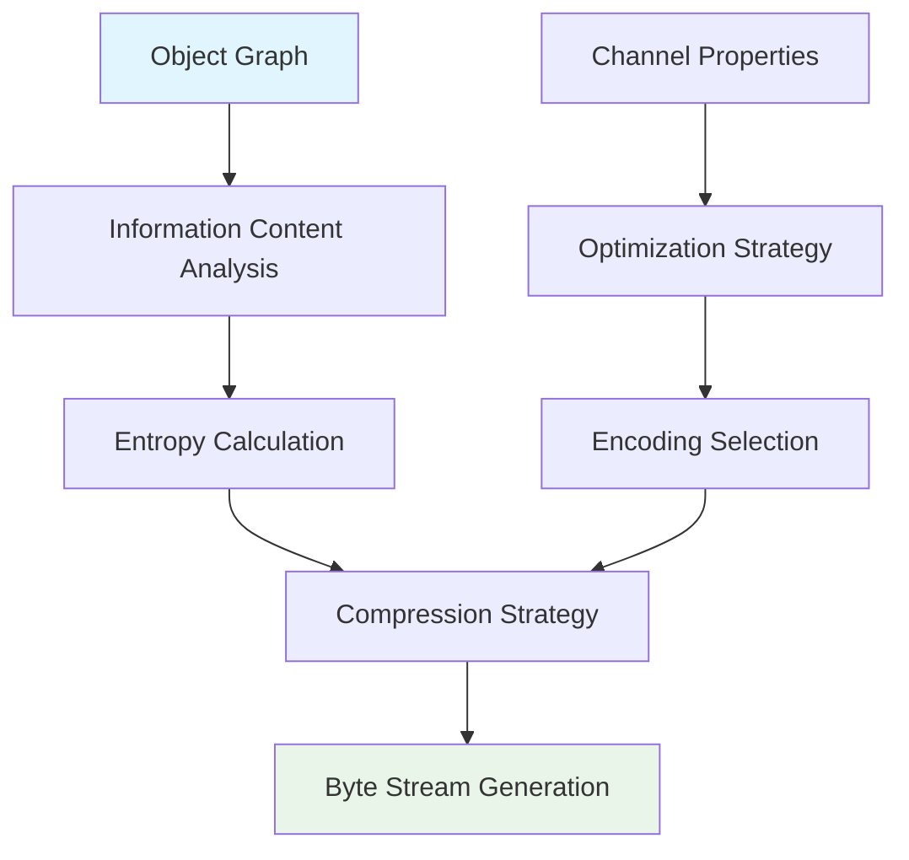
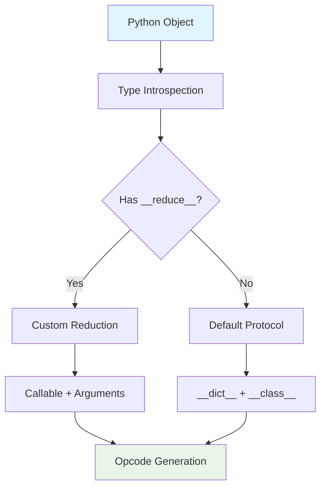
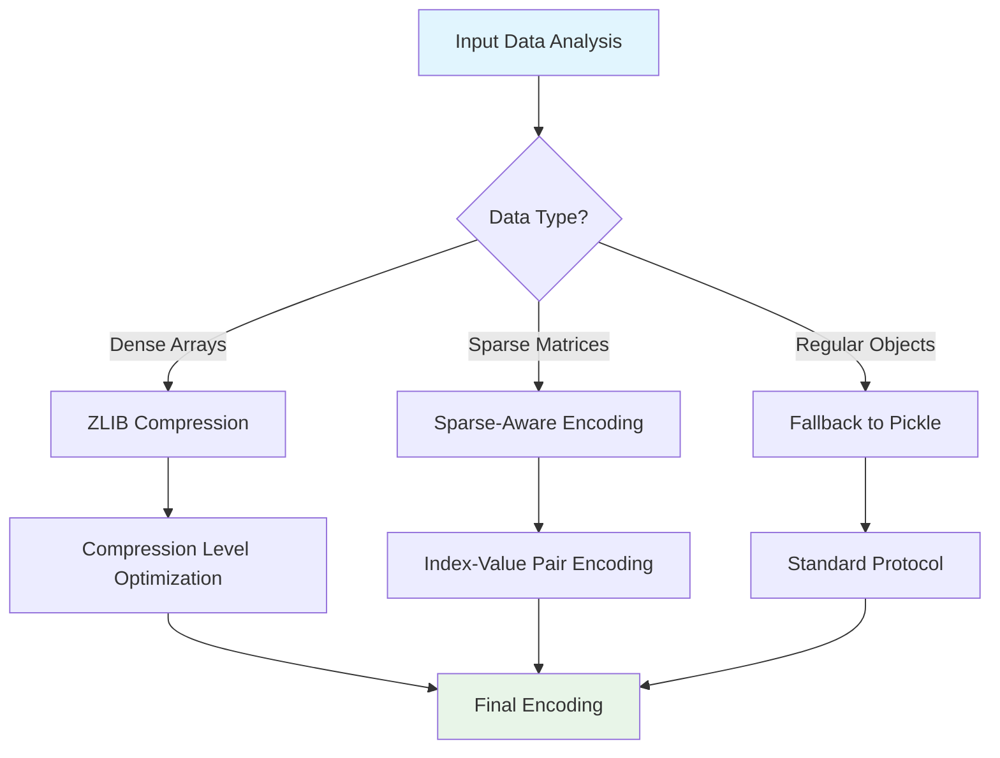
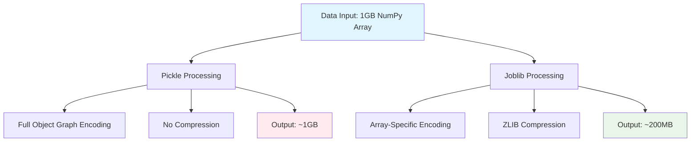
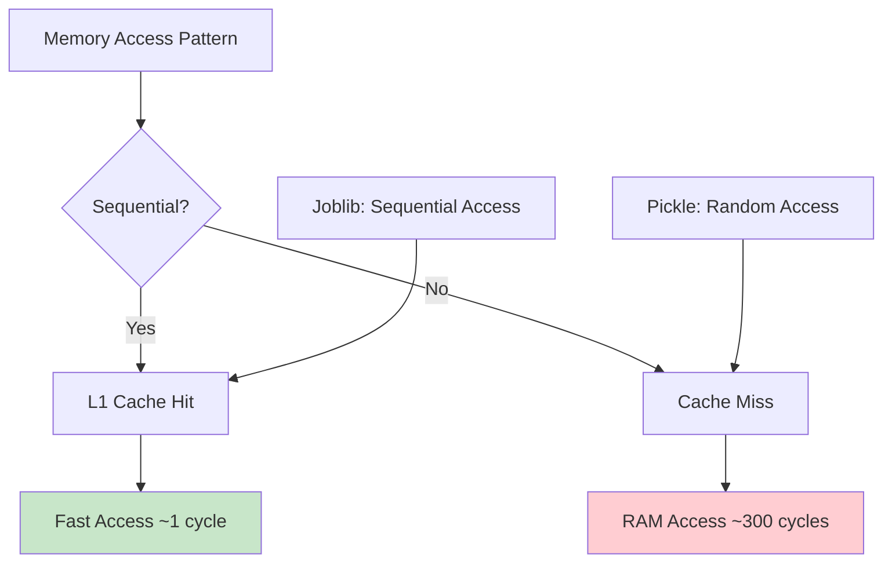
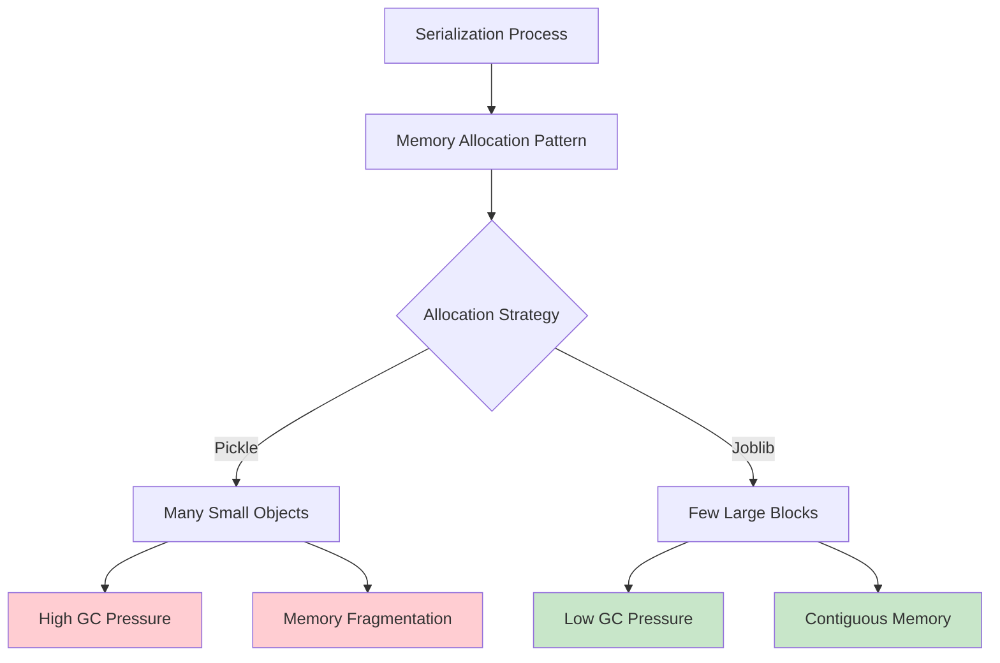
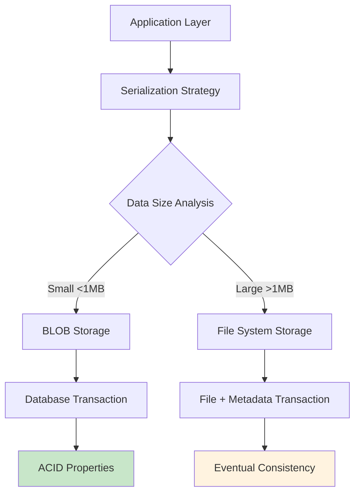
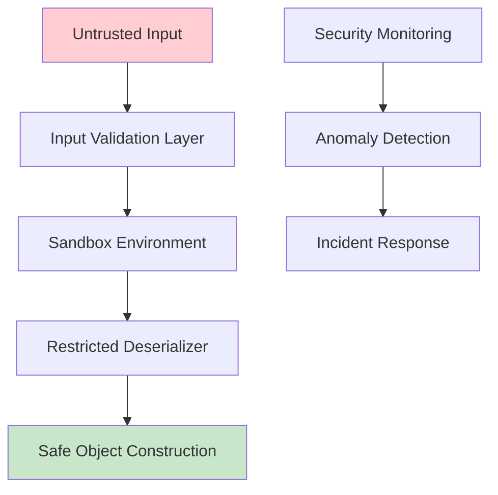
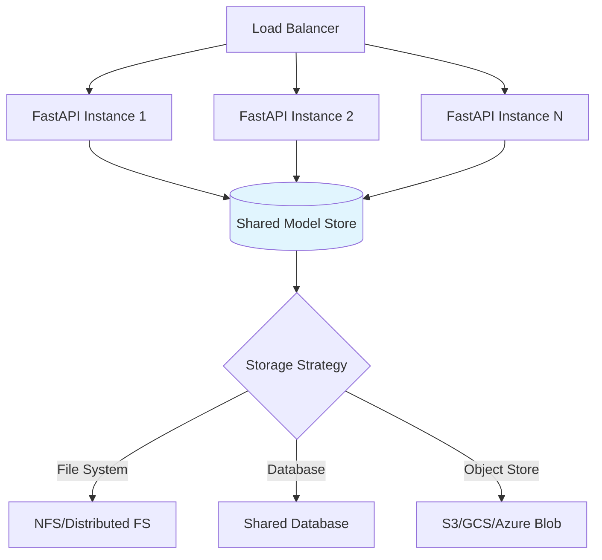

# Pickle vs Joblib: Comprehensive Theoretical Analysis

This document provides an exhaustive theoretical comparison between `pickle` and `joblib` for serialization in Python, with deep focus on underlying mechanisms, computer science principles, and FastAPI integration theory.

---

## Table of Contents

1. [Theoretical Foundations of Serialization](#theoretical-foundations-of-serialization)
2. [Pickle: Computer Science Theory](#pickle-computer-science-theory)
3. [Joblib: Optimization Theory](#joblib-optimization-theory)
4. [Comparative Analysis Framework](#comparative-analysis-framework)
5. [Performance Theory & Complexity Analysis](#performance-theory--complexity-analysis)
6. [Memory Management Theory](#memory-management-theory)
7. [Database Integration Theory](#database-integration-theory)
8. [Security Theory & Threat Models](#security-theory--threat-models)
9. [Architectural Design Principles](#architectural-design-principles)

---

## Theoretical Foundations of Serialization

### Core Computer Science Concepts

**Serialization Theory**: At its core, serialization is a form of **data transformation** that maps complex in-memory object graphs to linear byte sequences. This process involves several fundamental computer science principles:

1. **Graph Traversal**: Object serialization requires traversing object reference graphs, handling cycles, and maintaining referential integrity.

2. **Memory Layout Translation**: Converting from heap-allocated, pointer-based structures to contiguous byte arrays.

3. **Type System Preservation**: Maintaining type information across the serialization boundary to enable accurate reconstruction.

### Mathematical Foundation

The serialization process can be modeled as a bijective function:
```
S: O → B (Serialization)
D: B → O (Deserialization)
```

Where:
- O = Set of all serializable objects
- B = Set of all byte sequences
- D ∘ S = Identity function (perfect round-trip)

### Information Theory Perspective

From an **information theory** standpoint, serialization is fundamentally about:

- **Data Compression**: Reducing redundancy while preserving information content
- **Entropy Management**: Organizing data to minimize storage requirements
- **Channel Capacity**: Optimizing data for transmission or storage mediums



---

## Pickle: Computer Science Theory

### Virtual Machine Architecture

Pickle implements a **stack-based virtual machine** with a custom instruction set. This design follows classical interpreter architecture principles:

#### Theoretical Components:

1. **Opcode System**: A domain-specific language for object reconstruction
2. **Execution Stack**: LIFO data structure for intermediate values
3. **Memo Dictionary**: Reference tracking for object deduplication

### Protocol Evolution Theory

Pickle's protocol evolution demonstrates **backward compatibility theory** in practice:

#### Protocol Design Principles:

| Protocol | Theoretical Focus | Innovation |
|----------|-------------------|------------|
| 0 | Human Readability | ASCII encoding for debugging |
| 1 | Binary Efficiency | Space optimization |
| 2 | Object Model Support | New-style class compatibility |
| 3 | Unicode Integration | Python 3 string model |
| 4 | Large Data Handling | 64-bit indexing, framing |
| 5 | Out-of-band Data | Zero-copy optimizations |

### Algorithmic Complexity

**Time Complexity**: O(n) where n = total objects in graph
**Space Complexity**: O(d) where d = maximum depth of object graph

The linear time complexity comes from the single-pass traversal requirement, while space complexity depends on recursion depth due to the stack-based approach.

### Type System Theory

Pickle's type handling demonstrates **reflection theory** in practice:



### Reduction Protocol Theory

The `__reduce__` protocol embodies **functional programming** principles:
- **Immutable Reconstruction**: Objects rebuilt from pure functions
- **Compositional Design**: Complex objects built from simpler components
- **Referential Transparency**: Same inputs always produce same outputs

---

## Joblib: Optimization Theory

### Specialized Serialization Theory

Joblib represents a **domain-specific optimization** approach, applying specialized algorithms for numerical computing contexts:

#### Core Optimization Principles:

1. **Data Locality**: Numerical arrays benefit from contiguous memory layout
2. **Compression Theory**: Scientific data often has patterns amenable to compression
3. **Memory Mapping**: Virtual memory systems can optimize large array access

### Numerical Computing Integration

**Cache-Friendly Design**: Joblib aligns with CPU cache behavior:
- **Spatial Locality**: Sequential array access patterns
- **Temporal Locality**: Repeated access to same data regions

### Compression Theory Application

Joblib applies **lossless compression algorithms** optimized for numerical data:

#### Compression Strategy Selection:



### Memory Management Theory

**Memory Mapping Theory**: Joblib leverages OS virtual memory subsystems:

- **Demand Paging**: Load data only when accessed
- **Copy-on-Write**: Multiple processes share read-only data
- **Page Cache Integration**: OS manages memory more efficiently than application

---

## Comparative Analysis Framework

### Theoretical Performance Model

#### Pickle Performance Model:
```
T_pickle = O(n) * C_python_object_traversal + O(m) * C_opcode_generation
```

#### Joblib Performance Model:
```
T_joblib = O(k) * C_type_dispatch + O(n) * C_specialized_handler + O(c) * C_compression
```

Where:
- n = number of objects
- m = opcode stream length
- k = type analysis overhead
- c = compression computation

### Information Density Theory

**Pickle Information Density**:
- High metadata overhead for type preservation
- Optimized for object graph fidelity
- Poor compression ratio for numerical data

**Joblib Information Density**:
- Minimal metadata for known types
- Optimized for numerical data patterns
- Excellent compression for arrays



### Theoretical Comparison Matrix

| Aspect | Pickle Theory | Joblib Theory | Analysis |
|--------|---------------|---------------|----------|
| **Computational Complexity** | O(n) object traversal | O(k) + O(n) specialized | Joblib adds dispatch overhead |
| **Memory Complexity** | O(d) recursion depth | O(1) streaming | Joblib more memory efficient |
| **Information Theory** | High entropy preservation | Low entropy, high compression | Trade-off between fidelity and efficiency |
| **Type System Integration** | Complete Python type system | Numerical computing subset | Generality vs. specialization |
| **Cache Performance** | Poor (pointer chasing) | Excellent (sequential access) | Hardware architecture alignment |

---

## Performance Theory & Complexity Analysis

### Asymptotic Behavior Analysis

#### Big-O Notation Comparison:

**Pickle Complexity**:
- Time: O(n log n) for complex graphs with deduplication
- Space: O(n) for memo storage
- I/O: O(n) single pass write

**Joblib Complexity**:
- Time: O(n + c) where c = compression time
- Space: O(1) streaming approach
- I/O: O(log n) with compression

### Cache Theory Application

**CPU Cache Behavior**:



### Theoretical Performance Bounds

#### Information-Theoretic Limits:

1. **Compression Bound**: Cannot compress below data entropy
2. **Time-Space Trade-off**: Faster serialization requires more memory
3. **Network Efficiency**: Smaller payloads reduce transmission time

---

## Memory Management Theory

### Virtual Memory Integration

**Memory Mapping Theory**: Modern operating systems provide virtual memory abstractions that joblib exploits:

#### Theoretical Advantages:

1. **Lazy Loading**: Pages loaded on first access
2. **Shared Memory**: Multiple processes share read-only pages
3. **OS-Level Caching**: Operating system manages page cache

### Garbage Collection Impact

**Python GC Theory**: Both serialization methods interact with Python's garbage collector differently:

#### Pickle GC Interaction:
- Creates temporary objects during deserialization
- Triggers GC cycles due to reference creation
- Memory fragmentation from object allocation

#### Joblib GC Interaction:
- Minimal object creation for numerical data
- Reduced GC pressure through memory mapping
- Better memory locality reduces fragmentation



---

## Database Integration Theory

### Storage Engine Considerations

**Theoretical Database Integration Models**:

#### Model 1: Binary Large Object (BLOB) Storage
- **Theory**: Treat serialized data as opaque binary
- **Advantages**: Simple integration, ACID properties
- **Disadvantages**: No query ability, potential size limits

#### Model 2: Hybrid Storage Architecture
- **Theory**: Metadata in relational tables, binary in filesystem
- **Advantages**: Query performance, unlimited size
- **Disadvantages**: Consistency challenges, backup complexity



### Transaction Theory

**ACID Properties in Serialization Context**:

1. **Atomicity**: Serialization success/failure as atomic operation
2. **Consistency**: Object state preservation across boundaries
3. **Isolation**: Concurrent access to serialized data
4. **Durability**: Persistence guarantees for serialized objects

### Database Performance Theory

**Index Strategy for Serialized Data**:
- **Metadata Indexing**: Index on object metadata, not binary content
- **Content-Based Indexing**: Extract searchable fields before serialization
- **Hybrid Approaches**: Combine both strategies for optimal performance

---

## Security Theory & Threat Models

### Deserialization Attack Theory

**Fundamental Security Problem**: Deserialization inherently involves code execution, creating attack vectors:

#### Threat Model Components:

1. **Attacker Capabilities**: Can craft malicious serialized payloads
2. **Attack Surface**: Any deserialization endpoint
3. **Impact**: Arbitrary code execution with application privileges

### Theoretical Security Measures

#### Defense-in-Depth Strategy:



#### Theoretical Security Frameworks:

| Security Layer | Pickle Implementation | Joblib Implementation |
|----------------|----------------------|----------------------|
| **Input Validation** | Custom Unpickler classes | File format verification |
| **Sandboxing** | Process isolation | Container-based isolation |
| **Access Control** | Module whitelist | Type restrictions |
| **Monitoring** | Opcode analysis | File integrity checks |

### Cryptographic Integration Theory

**Authenticated Serialization**: Combining serialization with cryptographic primitives:

1. **Message Authentication Codes (MAC)**: Verify data integrity
2. **Digital Signatures**: Prove data authenticity
3. **Encryption**: Protect data confidentiality

---

## Architectural Design Principles

### System Architecture Theory

**Microservices Integration**: Both serialization methods fit different architectural patterns:

#### Pickle in Distributed Systems:
- **Pros**: Complete Python object fidelity
- **Cons**: Language lock-in, security risks
- **Use Case**: Internal service communication

#### Joblib in Distributed Systems:
- **Pros**: Optimized for data-heavy workloads
- **Cons**: Limited to numerical data
- **Use Case**: ML model distribution, data pipeline caching

### Scalability Theory

**Horizontal Scaling Considerations**:



### Design Pattern Theory

**Common Architectural Patterns**:

#### Repository Pattern with Serialization:
```
Repository Layer → Serialization Strategy → Storage Backend
```

#### Factory Pattern for Serialization:
- **SerializerFactory**: Choose serialization method based on data type
- **Strategy Pattern**: Runtime selection of serialization algorithm
- **Adapter Pattern**: Uniform interface over different serializers

### Performance Optimization Theory

**Theoretical Optimization Strategies**:

1. **Lazy Loading**: Load serialized objects on first access
2. **Caching Layers**: Multi-level caching for frequently accessed data
3. **Compression Trade-offs**: Balance compression ratio vs. CPU usage
4. **Parallel Processing**: Concurrent serialization for independent objects

### Conclusion: Theoretical Framework

The choice between pickle and joblib represents a fundamental trade-off in computer science: **generality versus specialization**. 

**Pickle** embodies the principle of **universal computation** - it can handle any Python object but sacrifices efficiency for generality.

**Joblib** represents **domain-specific optimization** - it excels in numerical computing contexts but lacks the universal applicability of pickle.

In FastAPI applications, this translates to architectural decisions:
- Use **pickle** for configuration, session state, and complex application objects
- Use **joblib** for machine learning models, large datasets, and numerical computations

The theoretical framework suggests that optimal systems will employ **hybrid approaches**, selecting the appropriate serialization method based on data characteristics and performance requirements.

Understanding these theoretical foundations enables architects and developers to make informed decisions about serialization strategies in